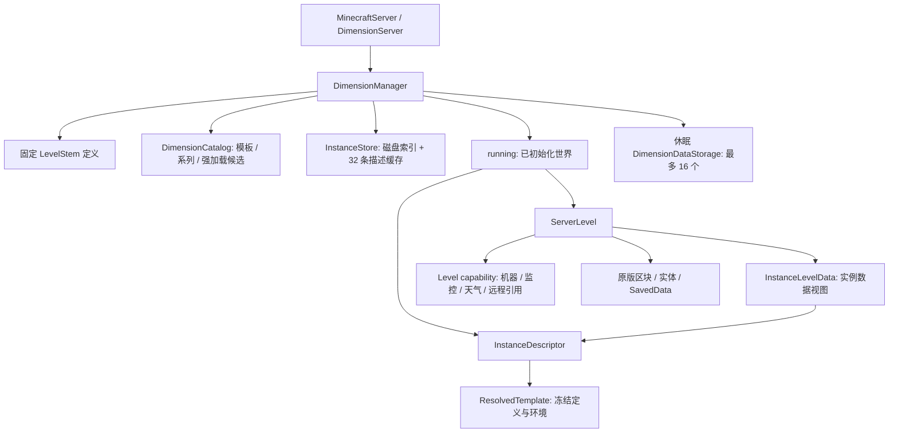
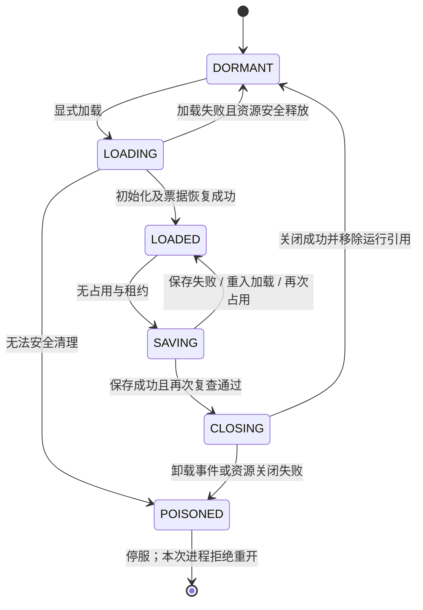

# 动态维度系统

本文描述 `dynamic-dim` 分支当前源码中的维度系统。核心实现在 [GTOLib 的 dimension 包](../GTOLib/src/main/java/com/gtolib/api/dimension)，GTOCore 负责游戏入口、天气及部分依赖模组适配。本文同时包含维度与天气存盘说明。类名链接定位到声明，流程链接定位到实现方法；原版及第三方入口链接到本分支负责接管它们的 Mixin 方法。（[DimensionManager][src-dimensionmanager-57]；[GTOCore ForgeCommonEvent.onLevelLoad][src-forgecommonevent-414]；[WeatherSystem][src-weathersystem-33]）

系统把**定义、持久化实例、运行世界**分开管理。登记模板或创建实例描述不会构造 `ServerLevel`；需要区块、实体或传送时才显式加载。卸载关闭运行资源，保留定义、实例描述和世界目录，下次访问重新构造 `ServerLevel`。（[DimensionManager.getOrCreatePrivate][src-dimensionmanager-243]；[DimensionManager.load][src-dimensionmanager-431]；[DimensionManager.unload][src-dimensionmanager-822]）

## 1. 数据内存架构与类架构

### 1.1 三类维度与三层数据

| 维度类别 | 定义来源 | 身份与种子 | 运行方式 |
|---|---|---|---|
| 主世界 | 启动注册表中的 `LevelStem.OVERWORLD` | 原世界身份与种子 | 按主世界初始化流程创建，始终常驻；[DimensionServerMixin.createLevels][src-dimensionservermixin-142]；[DimensionManager.resident][src-dimensionmanager-903] |
| 固定维度 | 数据包 `LEVEL_STEM`，或代码 `registerDefinition`；包括下界、末地、星球、轨道及 AE2 空间存储世界 | 固定维度键；沿用原世界种子与对应生成器 | 定义常驻内存，运行世界可以休眠；[DimensionManager.registerDefinition][src-dimensionmanager-199]；[DimensionCompatibility.register][src-dimensioncompatibility-23]；[DimensionServerMixin.gtolib$createLevel][src-dimensionservermixin-238] |
| 动态实例 | 私人地址或系列地址对应的 [InstanceDescriptor][src-instancedescriptor-22] | `gtocore:instance/<UUID>`；首次创建确定的独立种子 | 描述按需读取，运行世界按需创建；不加入数据包 `LEVEL_STEM` 注册表；[InstanceKey.id][src-instancekey-53]；[DimensionManager.getOrCreatePrivate][src-dimensionmanager-243]；[DimensionManager.getOrCreateSeries][src-dimensionmanager-263]；[DimensionManager.load][src-dimensionmanager-431] |

“维度存在”表示有可加载的固定定义或实例描述；“维度运行”表示本次 `ServerLevel` 已初始化完成。`state(key) == DORMANT` 也可能是未知键，判断存在性应使用 [isDefined(key)][src-dimensionmanager-314]。（[DimensionManager.state][src-dimensionmanager-655]；[DimensionManager.load][src-dimensionmanager-431]）

[DimensionManager][src-dimensionmanager-57] 绑定单个 `MinecraftServer`，由注入服务器的 [DimensionServer][src-dimensionserver-13] 接口取得，不是跨存档的静态管理器。它持有的数据如下：（[DimensionManager 构造器][src-dimensionmanager-81]；[DimensionServerMixin.gtolib$dimensions][src-dimensionservermixin-130]）

| 内存对象 | 内容 | 生命周期与规模 |
|---|---|---|
| `definitions` | 固定维度键 → `LevelStem` | 从启动注册表及代码登记建立；不包含动态历史实例；[DimensionManager.definitions][src-dimensionmanager-61]；[DimensionManager.registerDefinition][src-dimensionmanager-199] |
| `catalog` | 已解析模板、系列规则、持久化强加载候选集合 | 服务器级规则目录；不保存全部实例描述；[DimensionCatalog][src-dimensioncatalog-17] |
| `instances` | UUID → [InstanceDescriptor][src-instancedescriptor-22] 的访问缓存及磁盘索引 | 描述缓存最多 32 条；分页只读取对应页面，不扫描全库；[InstanceStore.cache][src-instancestore-24]；[InstanceStore.cache][src-instancestore-210]；[InstanceStore.page][src-instancestore-154] |
| `running` | 维度键 → `Running`，其中有 Level、描述、状态机、边界监听器及保存期间的加载请求 | 只持有已完成初始化的世界；动态描述也由运行记录持有，不能用“缓存 32 条”限制运行实例数；[DimensionManager.Running][src-dimensionmanager-1056]；[DimensionManager.load][src-dimensionmanager-431] |
| 内存 `pending` | 正在初始化的状态机及共享 future | 一次加载期间；与磁盘 `pending.dat` 创建事务日志是两种对象；[DimensionManager.Pending][src-dimensionmanager-1073]；[InstanceStore.create][src-instancestore-116] |
| `poisoned`、`unloadQueue` | 关闭失败记录、待安全卸载的键 | 当前服务器运行周期内；[DimensionManager.poisoned][src-dimensionmanager-64]；[DimensionManager.unloadQueue][src-dimensionmanager-65]；[DimensionManager.unload][src-dimensionmanager-822] |
| `snapshot` | 已初始化 `ServerLevel` 的稳定列表 | 增删运行世界时重建；用于世界枚举、tick、保存及 Forge 世界数组；[DimensionManager.refresh][src-dimensionmanager-1041]；[DimensionServerMixin.gtolib$refreshLevels][src-dimensionservermixin-251] |
| `metadataStores` | 休眠维度的 `DimensionDataStorage` | 最多 16 个存储对象；只打开 `data/`，不打开区块或实体系统；[DimensionManager.metadataStorage][src-dimensionmanager-154] |

运行索引使用 `ResourceKey` 的引用语义容器；目录使用 `O2OOpenCacheHashMap` / `OpenCacheHashSet`；描述和休眠存储使用按访问顺序淘汰的 `LinkedHashMap`。16 的上限限制的是休眠存储对象数，不是每个存储内部 SavedData 的条目数。（[DimensionManager][src-dimensionmanager-57]；[DimensionCatalog][src-dimensioncatalog-17]；[InstanceStore.cache][src-instancestore-24]；[DimensionManager.metadataStorage][src-dimensionmanager-154]）

世界内部的机器网络、监控状态、天气当前状态等绑定在 **Level 自身的 capability** 上。它们随该 Level 对象释放，不进入全局动态历史表。跨维度目标的弱引用索引也挂在目标 Level 上，卸载事件通知设备释放旧 Level、方块实体与处理器引用。客户端连接缓存单独管理，在断开连接时清理。（[LevelMixin.init][src-levelmixin-53]；[monitor.Manager.state][src-manager-59]；[WeatherSystem.state][src-weathersystem-85]；[DimensionRuntimeCaches.track][src-dimensionruntimecaches-31]；[DimensionRuntimeCaches.unload][src-dimensionruntimecaches-51]；[DimensionSync.Client.logout][src-dimensionsync-127]）



图中所有权与运行记录见 [DimensionManager.Running][src-dimensionmanager-1064]；[InstanceLevelData][src-instanceleveldata-13]；[InstanceDescriptor][src-instancedescriptor-22]；[ResolvedTemplate][src-resolvedtemplate-27]；[LevelMixin.init][src-levelmixin-53]。

### 1.2 主要类的职责

| 类或接口 | 职责 |
|---|---|
| [DimensionManager][src-dimensionmanager-57] | 授权、元数据查询、实例创建、加载请求合并、运行集合、保活、卸载及启动恢复 |
| [DimensionServer][src-dimensionserver-13] / [DimensionServerMixin][src-dimensionservermixin-64] | 连接服务器世界映射、世界工厂和 Forge 世界数组；接管启动创建及 tick 末尾维护 |
| [DimensionLifecycle][src-dimensionlifecycle-11] | 单次运行的状态、空闲起点及 `EnumMap<KeepAlive, Integer>` 租约计数；不执行 IO |
| [DimensionTemplate][src-dimensiontemplate-25] / [ResolvedTemplate][src-resolvedtemplate-27] | 模板登记入口与可保存的冻结快照；重开时由快照解析 `LevelStem` |
| [DimensionTemplates][src-dimensiontemplates-15] | 登记内置 `private_void`、`private_flat`、`overworld_noise` 模板 |
| [InstanceKey][src-instancekey-16] / [OwnerRef][src-ownerref-14] / [SeriesAddress][src-seriesaddress-13] | 私人或系列逻辑地址、玩家/队伍归属、系列序号与精确偏移 |
| [InstanceDescriptor][src-instancedescriptor-22] | 实例身份、种子、冻结模板、归属、权限、访客及出生点；不持有运行 Level |
| [SeriesDefinition][src-seriesdefinition-18] | 系列创建时冻结的模板、基础种子和新实例默认归属/权限 |
| [InstanceLevelData][src-instanceleveldata-13] | 继承 `DerivedLevelData`，隔离实例种子与出生点；时钟、游戏规则等仍沿用主世界数据视图 |
| [DimensionCatalog][src-dimensioncatalog-17] / [InstanceStore][src-instancestore-17] | 小型规则目录与独立实例文件、分页索引、单项创建事务恢复 |
| [DimensionDataCodecs][src-dimensiondatacodecs-9] / [DimensionDataIO][src-dimensiondataio-28] / [DimensionDataFixes][src-dimensiondatafixes-16] | 专用磁盘流式编解码、原子提交及 schema 分流迁移 |
| [DimensionSaveAttempt][src-dimensionsaveattempt-9] | 卸载及休眠元数据保存的线程局部失败收集作用域 |
| [DimensionSync][src-dimensionsync-28] | 目标连接的动态环境同步、客户端缓存及可选队伍权限事件 |
| [DimensionTickets][src-dimensiontickets-6] / [DimensionVehicle][src-dimensionvehicle-6] | 有效运行票据检查、活动载具的租约与随行区块票据 |
| [DimensionRuntimeCaches][src-dimensionruntimecaches-18] / [DimensionRemoteTarget][src-dimensionremotetarget-13] | 跨维度设备释放旧运行引用，按键重新绑定当前世界 |
| [DimensionCompatibility][src-dimensioncompatibility-13] / [DimensionStations][src-dimensionstations-26] | 依赖模组维度定义登记、无需加载地形的空间站查询与归属检查 |
| [WeatherSystem][src-weathersystem-33] / [InstanceWeatherData][src-instanceweatherdata-20] | 主世界天气时钟和固定维度日程、每个动态实例独立日程；当前状态存于 Level capability |

### 1.3 地址、冻结定义与调用边界

私人实例的逻辑身份由归属种类、归属 UUID、模板 ID、槽位决定；系列实例由系列 ID 和有符号 `long` 序号决定。字段以 UTF-8 和四字节长度前缀编码，整体 Base64 保存，再由原始字段字节调用 `UUID.nameUUIDFromBytes`。读取时对照逻辑键和文件 UUID，拒绝身份碰撞。模板版本不参与寻址。（[InstanceKey.privateKey][src-instancekey-29]；[InstanceKey.seriesKey][src-instancekey-42]；[InstanceKey.encode][src-instancekey-57]；[InstanceKey.id][src-instancekey-53]；[InstanceStore.find][src-instancestore-78]）

私人实例第一次创建才使用指定种子或随机种子；已有实例忽略后来传入的种子和模板版本。系列种子由基础种子与序号经过 SplitMix64 派生，系列地址偏移使用精确加法，溢出抛错。未访问的序号没有描述和地形文件，查询相邻地址也不创建实例。（[DimensionManager.getOrCreatePrivate][src-dimensionmanager-243]；[DimensionManager.getOrCreateSeries][src-dimensionmanager-263]；[SeriesDefinition.seed][src-seriesdefinition-41]；[SeriesAddress.offset][src-seriesaddress-31]）

模板解析时冻结完整 `LevelStem` JSON，内联噪声设置及多噪声生物群系预设参数；维度类型仍引用已注册 ID。新模板需要提升版本，同版本不同内容会被拒绝；模板升级不改已有系列或实例快照。冻结生成定义仍依赖当前注册表中的维度类型、生物群系、方块、生成器 codec 等对象，并不意味着删除这些依赖后仍能重开。（[ResolvedTemplate.resolve][src-resolvedtemplate-44]；[ResolvedTemplate.createStem][src-resolvedtemplate-91]；[DimensionCatalog.register][src-dimensioncatalog-72]；[DimensionCatalog.createSeries][src-dimensioncatalog-106]）

除 `load(key)` 能从其他线程提交外，管理器的查询与修改按服务器主线程使用：（[DimensionManager.load][src-dimensionmanager-431]；[DimensionManager.checkThread][src-dimensionmanager-1050]）

- [server.getLevel(key)][src-dimensionservermixin-233] 只查询当前映射；休眠时返回 `null`，不隐式加载。
- [server.getAllLevels()][src-dimensionservermixin-220] / [manager.levels()][src-dimensionmanager-113] 枚举已初始化的运行快照，不能用于枚举所有定义或全部历史实例。
- `descriptor`、`instances().page`、`metadataStorage`、空间站查询与休眠天气预报只访问元数据。（[DimensionManager.descriptor][src-dimensionmanager-285]；[InstanceStore.page][src-instancestore-154]；[DimensionManager.metadataStorage][src-dimensionmanager-154]；[DimensionStations.query][src-dimensionstations-37]；[WeatherSystem.forecast][src-weathersystem-205]）
- 面向实体的操作用 `loadFor(entity, key)`，先检查实体树中所有玩家乘客的权限，再加载。玩家安全传送用 `teleport(player, key)`。（[DimensionManager.loadFor][src-dimensionmanager-558]；[DimensionManager.teleport][src-dimensionmanager-595]）
- `load` / `loadNow` 是供已授权调用方使用的低层接口，本身不检查玩家权限。`loadNow` 要求主线程且 future 已完成，不能在初始化回调中等待自身加载。（[DimensionManager.load][src-dimensionmanager-431]；[DimensionManager.loadNow][src-dimensionmanager-540]；[DimensionManager.checkThread][src-dimensionmanager-1050]）

## 2. ServerLevel 生命周期

### 2.1 创建：启动世界、创建描述、加载世界是三个节点

[DimensionServerMixin][src-dimensionservermixin-64] 接管 [MinecraftServer.createLevels][src-dimensionservermixin-142]，先打开规则目录与实例索引，创建主世界，保留出生点、计分板、命令存储、Boss 事件、边界监听及主世界加载事件初始化。随后登记内置模板和 AE2 固定定义，按配置及持久化票据恢复其他世界。`prepareLevels` 只准备主世界出生区块并恢复其票据。（[DimensionServerMixin.prepareLevels][src-dimensionservermixin-191]；[DimensionTemplates.register][src-dimensiontemplates-37]；[DimensionCompatibility.register][src-dimensioncompatibility-23]；[DimensionManager.restoreStartup][src-dimensionmanager-715]）

默认 `GTOConfig.dimensions.enabled=true`、`idleTicks=1200`、`residentDimensions=[]`。当前运行逻辑只强制主世界常驻；下界、末地也可以休眠。配置额外常驻键会在启动显式加载。关闭懒加载时，启动加载全部固定定义并禁止安全卸载，动态历史仍按地址访问，不批量构造。（[GTOConfig.Dimensions][src-gtoconfig-189]；[DimensionManager.resident][src-dimensionmanager-903]；[DimensionManager.restoreStartup][src-dimensionmanager-715]）

创建私人实例或首次访问系列地址先保存 [InstanceDescriptor][src-instancedescriptor-22]，此时还没有 `ServerLevel`。真正的 `load(key)` 顺序如下：（[DimensionManager.getOrCreatePrivate][src-dimensionmanager-243]；[DimensionManager.getOrCreateSeries][src-dimensionmanager-263]；[DimensionManager.load][src-dimensionmanager-431]）

1. 转交服务器主线程；已运行的世界直接返回，正在加载的请求复用同一 future。`CLOSING` 或当前进程内 `POISONED` 的键拒绝加载；`SAVING` 请求等待保存完成并取消此次关闭。（[DimensionManager.load][src-dimensionmanager-431]）
2. 查询固定定义或实例描述。动态实例从冻结模板构造 `LevelStem`，固定维度用登记的定义；未知键失败。（[DimensionManager.load][src-dimensionmanager-431]；[ResolvedTemplate.createStem][src-resolvedtemplate-91]）
3. 建立内存 `pending`，状态进入 `LOADING`。若已有休眠 `DimensionDataStorage`，先受检查地保存并从休眠缓存移除，随后由新 Level 重新读取，避免两个存储对象同时维护数据。（[DimensionManager.load][src-dimensionmanager-431]；[DimensionManager.saveMetadata][src-dimensionmanager-885]；[DimensionLifecycle.beginLoad][src-dimensionlifecycle-49]）
4. 通过 `gtolib$createLevel` 调用正常 `ServerLevel` 构造器。固定维度用 `DerivedLevelData` 和原世界种子；动态实例用 [InstanceLevelData][src-instanceleveldata-13] 和独立种子。动态实例及 AE2 空间世界使用独立随机序列存储，其他固定世界沿用主世界随机序列。（[DimensionServerMixin.gtolib$createLevel][src-dimensionservermixin-238]）
5. 将世界边界接入主世界委托监听，写入服务器世界映射，发布 `LevelEvent.Load`，恢复原版及 Forge 持久化强加载并执行校验回调。（[DimensionManager.load][src-dimensionmanager-431]；[DimensionManager.restoreForcedChunks][src-dimensionmanager-946]）
6. 全部成功后标为 `LOADED`，加入 `running`，移除 `pending`，刷新稳定快照及 Forge 世界数组，最后完成 future。（[DimensionManager.load][src-dimensionmanager-431]；[DimensionLifecycle.loaded][src-dimensionlifecycle-62]；[DimensionManager.refresh][src-dimensionmanager-1041]；[DimensionServerMixin.gtolib$refreshLevels][src-dimensionservermixin-251]）

加载事件期间 `getLevel` 可以取得正在构造的世界，供事件读取数据；它尚未进入已初始化快照，底层传送守卫也不允许进入。因此取得非空 Level 引用不等于可以传送，操作入口必须检查状态或等待 future。（[DimensionManager.load][src-dimensionmanager-431]；[DimensionServerMixin.getLevel][src-dimensionservermixin-233]；[DimensionManager.mayTransfer][src-dimensionmanager-573]）

实例种子不仅替换 `getSeed()`，还在 `ServerLevel` 构造阶段替换生成种子，让噪声、结构生成状态、`StructureCheck`、随机序列及混淆种子一致。安全传送会验证已存出生点；虚空模板需要时建立 5×5 平台，地表模板选择地表并清理站立空间，保存出生位置与朝向。（[ServerLevelMixin.gtolib$instanceGenerationSeed][src-serverlevelmixin-36]；[ServerLevelMixin.gtolib$instanceSeed][src-serverlevelmixin-41]；[DimensionManager.safeSpawn][src-dimensionmanager-958]）

加载失败会清除映射和 pending、解除边界监听，并尝试发布卸载事件和关闭已创建资源。能够安全关闭时回到休眠；构造器失败且无法取得待关闭资源，或清理关闭再次失败时，标记 `POISONED` 并请求停服。（[DimensionManager.load][src-dimensionmanager-431]；[DimensionManager.detach][src-dimensionmanager-876]；[DimensionLifecycle.loadFailed][src-dimensionlifecycle-75]；[DimensionLifecycle.poison][src-dimensionlifecycle-200]）

### 2.2 维护：只观察运行世界

服务器 `tickServer` 末尾调用 `tickEnd()`。每 20 tick 检查一次运行快照：复核在线玩家权限、观察空闲状态、更新持久化强加载候选；每 tick 处理卸载队列。动态历史实例不参与全库 tick。（[DimensionServerMixin.gtolib$unloadIdleDimensions][src-dimensionservermixin-258]；[DimensionManager.tickEnd][src-dimensionmanager-758]）

以下条件阻止卸载：（[DimensionManager.occupied][src-dimensionmanager-897]；[DimensionLifecycle.leases][src-dimensionlifecycle-40]）

| 条件 | 检测与用途 |
|---|---|
| 主世界或配置常驻 | `resident(key)`；关闭懒加载时所有已加载世界视为常驻；[DimensionManager.resident][src-dimensionmanager-903] |
| 在线玩家 | 运行世界的 `players()` 非空；[DimensionManager.occupied][src-dimensionmanager-897] |
| 原版/Forge 持久化强加载 | `ForgeChunkManager.hasForcedChunks(level)`；[DimensionManager.occupied][src-dimensionmanager-897] |
| 未过期的运行票据 | [DimensionTickets][src-dimensiontickets-6] 检查 `DistanceManager`；排除 `UNKNOWN`、`LIGHT`、`PLAYER`、`DRAGON`，玩家另查；[DimensionTicketsMixin.gtolib$hasActiveTickets][src-dimensionticketsmixin-28] |
| 显式租约 | `TRANSFER`、`ROCKET`、`LANDER`、`BUILD`、`SPATIAL_EXCHANGE`、`EXPLICIT` 的引用计数非空；[DimensionManager.keepAlive][src-dimensionmanager-619]；[DimensionLifecycle.acquire][src-dimensionlifecycle-90]；[DimensionLifecycle.release][src-dimensionlifecycle-104] |

占用或租约使空闲起点重置；持续空闲达到阈值才入队。手动 `requestUnload` 同样拒绝常驻、玩家、票据或租约占用，且执行时重新检查。（[DimensionLifecycle.observe][src-dimensionlifecycle-124]；[DimensionManager.tickEnd][src-dimensionmanager-758]；[DimensionManager.requestUnload][src-dimensionmanager-637]；[DimensionManager.unload][src-dimensionmanager-822]）

租约只保活维度，不能替代区块票据。跨 tick 操作必须持有并在结束时关闭租约；传送、空间站建造和 AE2 交换使用作用域租约。飞行火箭和未落地着陆器额外维护随位置移动、40 tick 过期的区块票据，活动时刷新，落地、移除或换世界时释放。普通静止实体会随世界保存休眠；需要离线运行的设备仍需有效区块强加载。（[DimensionManager.keepAlive][src-dimensionmanager-619]；[DimensionManager.teleport][src-dimensionmanager-595]；[DimensionConstructPacketMixin.gtolib$build][src-dimensionconstructpacketmixin-24]；[DimensionSpatialExchangeMixin.gtolib$pinExchange][src-dimensionspatialexchangemixin-21]；[DimensionVehicleMixin.gtolib$vehicleActive][src-dimensionvehiclemixin-41]；[DimensionVehicleMixin.gtolib$releaseFlight][src-dimensionvehiclemixin-66]；[RocketMixin.gtolib$keepFlightAlive][src-rocketmixin-17]；[LanderMixin.gtolib$keepLandingAlive][src-landermixin-18]）

权限由实例策略、个人所有者或当前队伍成员、显式访客、管理员等级 2 决定。队伍删除后普通玩家即使有访客授权也不能进入。撤销访客和队伍事件立即复查，常规每 20 tick 再检查一次，把失去权限的在线玩家送回主世界。实例访问权、星球解锁和空间站归属分别判断。（[DimensionManager.canAccess][src-dimensionmanager-325]；[DimensionManager.grant][src-dimensionmanager-397]；[DimensionManager.enforcePermissions][src-dimensionmanager-782]；[DimensionSync.Teams.enforce][src-dimensionsync-157]；[DimensionStations.mayLand][src-dimensionstations-53]）

### 2.3 回收：保存成功且复查通过才关闭



图中状态转移由 [DimensionLifecycle.beginLoad][src-dimensionlifecycle-49]；[DimensionLifecycle.loaded][src-dimensionlifecycle-62]；[DimensionLifecycle.observe][src-dimensionlifecycle-124]；[DimensionLifecycle.beginSave][src-dimensionlifecycle-144]；[DimensionLifecycle.cancelSave][src-dimensionlifecycle-158]；[DimensionLifecycle.beginClose][src-dimensionlifecycle-173]；[DimensionLifecycle.closed][src-dimensionlifecycle-189]；[DimensionLifecycle.poison][src-dimensionlifecycle-200]；[DimensionManager.unload][src-dimensionmanager-822] 实现。

卸载时先进入 `SAVING`，在 [DimensionSaveAttempt][src-dimensionsaveattempt-9] 作用域中调用 `level.save(null, true, false)`、SavedData 保存及实例描述保存。原版部分只记日志的错误会被传播，区域异步写入会等待 future，避免保存尚未成功就关闭。（[DimensionManager.unload][src-dimensionmanager-822]；[DimensionSaveAttempt.begin][src-dimensionsaveattempt-20]；[DimensionSavedDataMixin.gtolib$checkedUnloadSave][src-dimensionsaveddatamixin-36]；[DimensionIOWorkerMixin.gtolib$awaitUnloadWrite][src-dimensionioworkermixin-28]）

保存失败回到 `LOADED`，保留运行引用并重置空闲计时，后续可重试。保存回调中的加载请求也会取消卸载，返回当前世界。保存完成后再次检查玩家、票据及租约，通过才进入 `CLOSING`。（[DimensionManager.unload][src-dimensionmanager-822]；[DimensionManager.load][src-dimensionmanager-431]；[DimensionLifecycle.cancelSave][src-dimensionlifecycle-158]）

正常关闭发布 `LevelEvent.Unload`，调用 `ServerLevel.close()`，移除边界委托监听、服务器世界映射和 `running` 条目，再刷新快照、Forge 世界数组及计时缓存。保存目录与实例描述保留。下一次加载得到新对象；维度键相同的旧 Level 引用不能继续用于传送、着陆或设备处理。（[DimensionManager.unload][src-dimensionmanager-822]；[DimensionManager.detach][src-dimensionmanager-876]；[DimensionServerMixin.gtolib$refreshLevels][src-dimensionservermixin-251]；[DimensionManager.mayTransfer][src-dimensionmanager-573]；[DimensionRuntimeCaches.unload][src-dimensionruntimecaches-51]）

卸载事件或资源关闭异常意味着已经无法保证资源状态完整，系统移除运行引用、记录 `POISONED` 并调用 `server.halt(false)`。这和可重试的保存失败不同，不会在同一次服务器运行中重新打开该世界。（[DimensionManager.unload][src-dimensionmanager-822]；[DimensionLifecycle.poison][src-dimensionlifecycle-200]；[DimensionManager.load][src-dimensionmanager-431]）

## 3. 网络同步

### 3.1 同步节点与内容

动态实例复用登录时已同步注册表中的 `DimensionType`，不发送新类型注册表或完整地形生成定义。实例自定义包由 [DimensionSync][src-dimensionsync-28] 经 [NetworkPack][src-networkpack-16] 注册为 `dimension_instance`。（[DimensionSync.PACKET][src-dimensionsync-30]；[NetworkPack.registerS2C][src-networkpack-18]）

| 节点 | 同步内容与接收者 | 触发位置 |
|---|---|---|
| 登录到固定或动态世界 | 原版登录包携带所有固定定义键，以及玩家当前世界键；不加入其他动态历史或其他玩家实例 | [DimensionPlayerListMixin][src-dimensionplayerlistmixin-32] 修改 `placeNewPlayer` 的维度集合；[DimensionPlayerListMixin.gtolib$onlyConnectedDynamicDimensions][src-dimensionplayerlistmixin-51]；[DimensionManager.fixedDimensionKeys][src-dimensionmanager-122] |
| 登录到动态实例，原版 Login 包构造前 | 目标实例环境包，只发该玩家；允许客户端在玩家/ClientLevel 建立前暂存环境 | `placeNewPlayer` → [DimensionSync.prepare][src-dimensionsync-73]；[DimensionPlayerListMixin.gtolib$syncLoginInstance][src-dimensionplayerlistmixin-62] |
| 重生到动态实例，原版 Respawn 包构造前 | 目标实例环境包，只发重生连接 | [PlayerList.respawn 的同步注入][src-dimensionplayerlistmixin-69] 注入；[DimensionSync.prepare][src-dimensionsync-73] |
| 实际跨维度进入动态实例前 | 目标实例环境包，只发被传送玩家 | [ServerPlayer.changeDimension 的入口守卫][src-dimensionplayermixin-45] 和跨 Level 的 `teleportTo` 守卫；[DimensionPlayerMixin.gtolib$authorizeTeleport][src-dimensionplayermixin-59]；[DimensionPlayerMixin.gtolib$authorizeRelativeTeleport][src-dimensionplayermixin-75] |
| 登录、切维度、重生完成及实际天气类型变化 | 所在维度键、天气注册整数 ID、当前雨强度与原始雷强度；天气变化发送给该世界内玩家 | GTOCore 玩家事件及 [WeatherSystem.apply][src-weathersystem-228] / [WeatherSystem.sync][src-weathersystem-248]；[GTOCore ForgeCommonEvent.onPlayerLoggedInEvent][src-forgecommonevent-371]；[GTOCore ForgeCommonEvent.onPlayerChangedDimensionEvent][src-forgecommonevent-399]；[GTOCore ForgeCommonEvent.onPlayerRespawnEvent][src-forgecommonevent-409] |
| 维度参数补全 | 使用原版命令补全请求/响应，返回固定定义及当前可访问的已加载动态实例 | [DimensionArgument.listSuggestions 的补全注入][src-dimensionargumentmixin-35]；不扫描历史、不加载世界 |
| 打开星球菜单、天气预报等界面 | 各界面自己的目标/站点/预报数据，按查询需求发送 | 相应菜单与 UI 同步路径；不是动态维度目录广播；[DimensionPlanetsMenuProviderMixin.writeExtraData][src-dimensionplanetsmenuprovidermixin-34]；[WeatherForecastUI.writeHolderToSyncData][src-weatherforecastui-99]；[WeatherForecastUI.encode][src-weatherforecastui-250] |

环境包字段为：维度 `ResourceLocation`、已注册 `DimensionType` 的 VarInt ID、混淆后的种子 `long`、虚空标记、氧气、重力、温度、太阳能与天气 profile ID。归属、访客、系列规则、完整生成 JSON、磁盘载荷及历史天气日程不进入该包。（[DimensionSync.PACKET][src-dimensionsync-30]；[DimensionEnvironment][src-dimensionenvironment-15]）

当前客户端接收实现缓存并应用环境、检查维度类型 ID，更新连接的维度键集合；它读取混淆种子但未单独应用该值，实际创建 ClientLevel 的类型与种子仍由原版 Login/Respawn 包承载。不要把这个自定义包理解为重新实现原版世界进入协议。（[DimensionSync.Client.receive][src-dimensionsync-97]；[DimensionPlayerListMixin.gtolib$syncLoginInstance][src-dimensionplayerlistmixin-62]；[DimensionPlayerListMixin.gtolib$syncRespawnInstance][src-dimensionplayerlistmixin-69]）

区块、实体、方块实体、背包等仍由原版/Forge 及各模组已有通道同步。保存、空闲检查、服务端加载成功或卸载本身没有全服动态目录广播，也没有维度删除包。固定定义登录后新增时，命令补全按请求读取服务器最新定义。（[DimensionSync.prepare][src-dimensionsync-73]；[DimensionManager.load][src-dimensionmanager-431]；[DimensionManager.unload][src-dimensionmanager-822]；[DimensionArgumentMixin.gtolib$suggestDefinedDimensions][src-dimensionargumentmixin-35]）

### 3.2 客户端缓存与包顺序

环境必须先于进入包到达，才能让新 `ClientLevel` 的 [LevelMixin][src-levelmixin-37] 从缓存应用虚空及星球环境。接收逻辑在客户端主线程执行；登录早期没有连接时先暂存环境。后续接收动态环境时只保留当前与即将进入的实例，清理更早的动态连接键，断开连接清空环境缓存。（[FromServerMessage.handle][src-fromservermessage-70]；[DimensionSync.Client.receive][src-dimensionsync-97]；[DimensionSync.Client.logout][src-dimensionsync-127]；[LevelMixin.init][src-levelmixin-53]）

天气包在玩家进入后的事件同步，与进入前的环境包职责不同。接收端检查包中的维度键，只应用到当前世界；雨/雷渐变根据初始强度和游戏时间计算，无需每 tick 同步。天气日程和随机状态属于服务端持久化数据，客户端不维护全部历史实例的天气。（[GTOCore ForgeCommonEvent.onPlayerChangedDimensionEvent][src-forgecommonevent-399]；[WeatherSystem.sync][src-weathersystem-248]；[Message.WEATHER_S2C][src-message-77]；[WeatherSystem.receiveWeather][src-weathersystem-109]；[WeatherState.intensity][src-weatherstate-20]）

### 3.3 专用服务器与集成服务器

两者使用同一管理器、加载与授权流程、同一环境包和天气包，没有跳过集成服务器同步的分支。集成服务器与客户端共享 JVM，也仍有独立的服务器线程、客户端线程和连接，不能直接共享服务端描述作为客户端状态。（[DimensionSync.init][src-dimensionsync-58]；[DimensionSync.prepare][src-dimensionsync-73]；[DimensionSync.Client.receive][src-dimensionsync-97]；[DimensionManager.load][src-dimensionmanager-431]）

按维度键查询环境的 [GTODimensions.isVoid][src-gtodimensions-57]、[WeatherProfiles.get][src-weatherprofiles-32] 在当前线程就是服务器线程时读取服务端描述；在客户端线程读取 [DimensionSync][src-dimensionsync-28] 的连接缓存。专用服务器只初始化服务端逻辑，客户端缓存监听通过 `DistExecutor` 在客户端环境注册。（[DimensionSync.clientEnvironment][src-dimensionsync-85]；[DimensionSync.init][src-dimensionsync-58]）

因此两种部署需要同步的字段和节点相同；区别在于集成服务器两端同进程、传输为本地连接。联机双客户端探针覆盖专用服务器路径，不能据此宣称集成服务器客户端表现已经验收。（[NetworkProbe.init][src-networkprobe-21]；[DimensionSync.prepare][src-dimensionsync-73]；[WeatherSystem.sync][src-weathersystem-248]）

## 4. 存盘与错误处理

### 4.1 哪些字段需要持久化

下表路径以世界根目录为基准。实例元数据与实际世界区块目录分离。（[DimensionCatalog 构造器][src-dimensioncatalog-30]；[InstanceStore.path][src-instancestore-205]；[DimensionManager.dimensionPath][src-dimensionmanager-928]）

| 数据 | 必须持久化的字段 | 文件与负责类 |
|---|---|---|
| 模板目录 | 模板 ID、版本、完整冻结生成 JSON、出生策略、环境六项字段 | `gtolib/dimensions/catalog.dat`；[DimensionCatalog][src-dimensioncatalog-17]；[DimensionDataCodecs.TEMPLATE][src-dimensiondatacodecs-37]；[DimensionDataCodecs.ENVIRONMENT][src-dimensiondatacodecs-20]；[DimensionCatalog.save][src-dimensioncatalog-147] |
| 系列规则 | 系列 ID、冻结模板、基础种子、默认归属种类/UUID、访问策略 | 同一 `catalog.dat`；[DimensionDataCodecs.SERIES][src-dimensiondatacodecs-50]；[DimensionCatalog.save][src-dimensioncatalog-147] |
| 强加载启动候选 | 需要在重启时检查真实持久化票据的维度 ID 集合 | 同一 `catalog.dat`；不是完整票据或运行租约；[DimensionCatalog.setForced][src-dimensioncatalog-126]；[DimensionDataIO.writeCatalogAtomic][src-dimensiondataio-83] |
| 实例描述 | 完整逻辑键、独立种子、创建序号、冻结模板、可选归属、访问策略、访客 UUID、可选出生坐标和角度 | `gtolib/dimensions/instances/<UUID前两位>/<UUID>.dat`；[InstanceStore][src-instancestore-17]；[DimensionDataCodecs.INSTANCE][src-dimensiondatacodecs-67]；[InstanceStore.path][src-instancestore-205]；[InstanceStore.save][src-instancestore-138] |
| 分页与创建事务 | 按创建顺序的 UUID；尚未完成创建的完整描述 | `gtolib/dimensions/instances/instances.index`（每条 16 字节）及同目录 `pending.dat`；[InstanceStore.create][src-instancestore-116]；[InstanceStore.appendIndex][src-instancestore-183]；[InstanceStore.recoverPending][src-instancestore-173] |
| 固定维度天气与共享天气时钟 | 时钟、维度键 → 日程；每个日程的随机状态、可选 `lastStormEnd`、天气 ID、开始时间及持续时间 | 主世界 `data/gtocore_galaxy_weather.dat`；[WeatherSystem][src-weathersystem-33]；[WeatherSystem.save][src-weathersystem-283]；[WeatherDataIO.writeGlobal][src-weatherdataio-67]；[WeatherTimeline.save][src-weathertimeline-188] |
| 动态实例天气 | 该实例独立日程，字段同上；不重复保存共享时钟 | 实例世界目录 `data/gtocore_instance_weather.dat`；[InstanceWeatherData][src-instanceweatherdata-20]；[InstanceWeatherData.save][src-instanceweatherdata-71]；[WeatherDataIO.writeInstance][src-weatherdataio-80]；[WeatherTimeline.save][src-weathertimeline-188] |
| 世界内容 | 区块、方块实体、实体、POI、SavedData、需要独立存储的随机序列等 | 原版目录和原协议；由 Level、区块/实体系统、各 SavedData 负责；[DimensionManager.unload][src-dimensionmanager-822]；[DimensionServerMixin.gtolib$createLevel][src-dimensionservermixin-238] |
| 原版/Forge 及第三方元数据 | 原版强加载、Forge owner/ticking 票据、Ad Astra 空间站、AE2 空间区域等原有字段 | 对应维度 `data/` 内各模组原有文件；[DimensionManager.restoreForcedChunks][src-dimensionmanager-946]；[DimensionStations.query][src-dimensionstations-37]；[DimensionSpatialStorageMixin.getWorldData][src-dimensionspatialstoragemixin-29] |

实例 UUID 和维度键由逻辑键派生，不在描述载荷中重复保存；目录 Map 的键由记录 ID 派生。模板/归属/访问策略枚举用固定序号，顺序变动需要 schema 迁移；天气类型保存稳定字符串 ID，网络另用注册整数 ID。生成 JSON 使用 VarInt 字节长度 + UTF-8，避开 `writeUTF` 的 64 KiB 上限。（[IOStreamCodecs.UTF8][src-iostreamcodecs-30]；[InstanceKey.id][src-instancekey-53]；[DimensionDataCodecs.TEMPLATE][src-dimensiondatacodecs-37]；[DimensionDataCodecs.SERIES][src-dimensiondatacodecs-50]；[DimensionDataCodecs.INSTANCE][src-dimensiondatacodecs-67]；[WeatherTimeline.save][src-weathertimeline-188]；[DimensionSync.PACKET][src-dimensionsync-30]）

运行状态、空闲 tick、future、租约计数、临时飞行票据、Level 引用、监听器、客户端缓存和能力中的派生运行索引不持久化。实例没有独立的完整 `level.dat` 副本：时间、游戏规则等共享世界数据仍由主世界持久化，实例独立出生点保存到描述。（[DimensionLifecycle][src-dimensionlifecycle-11]；[DimensionServerMixin.gtolib$createLevel][src-dimensionservermixin-238]；[InstanceLevelData.setSpawn][src-instanceleveldata-94]；[DimensionManager.saveDescriptor][src-dimensionmanager-1033]）

### 4.2 什么维度在什么情况下保存

| 情况 | 保存行为 |
|---|---|
| 登记或升级模板、创建系列、强加载候选集合发生变化 | 立即原子保存目录；内容未变不重复写入；[DimensionCatalog.register][src-dimensioncatalog-72]；[DimensionCatalog.createSeries][src-dimensioncatalog-106]；[DimensionCatalog.setForced][src-dimensioncatalog-126] |
| 首次创建私人实例或首次访问某系列序号 | 立即提交描述、分页索引和 pending 事务；不生成地形；[InstanceStore.create][src-instancestore-116] |
| 只登记固定维度或查询未创建系列地址 | 不生成动态描述/地形；固定定义由下次启动的数据包或代码重新登记；[DimensionManager.registerDefinition][src-dimensionmanager-199]；[SeriesAddress.offset][src-seriesaddress-31]；[DimensionManager.restoreStartup][src-dimensionmanager-715] |
| 修改访客权限、由安全传送确定出生点 | 保存对应描述；访客保存失败回滚内存授权；[DimensionManager.grant][src-dimensionmanager-397]；[DimensionManager.safeSpawn][src-dimensionmanager-958]；[DimensionManager.saveDescriptor][src-dimensionmanager-1033] |
| 动态实例的普通出生点 setter | 更新内存描述，随后由世界保存或卸载时保存；不是每个 setter 都立即写盘；[InstanceLevelData.setSpawn][src-instanceleveldata-94]；[InstanceLevelData.setXSpawn][src-instanceleveldata-104]；[InstanceLevelData.setYSpawn][src-instanceleveldata-114]；[InstanceLevelData.setZSpawn][src-instanceleveldata-124]；[InstanceLevelData.setSpawnAngle][src-instanceleveldata-134]；[DimensionManager.saveLoadedDescriptors][src-dimensionmanager-794] |
| 服务器 `saveAllChunks`，包括正常保存/停服路径 | 先保存运行实例描述及已缓存的休眠元数据；运行世界内容继续走正常保存流程，不遍历动态历史；[DimensionServerMixin.gtolib$saveInstanceMetadata][src-dimensionservermixin-265]；[DimensionManager.saveLoadedDescriptors][src-dimensionmanager-794] |
| 空闲或手动安全卸载 | 强制完成世界保存、SavedData 和描述保存，通过后才关闭；[DimensionManager.unload][src-dimensionmanager-822] |
| 查询休眠空间站/AE2 元数据 | 只读对应 SavedData；发生变更时由保存、缓存淘汰或后续加载前提交；[DimensionManager.metadataStorage][src-dimensionmanager-154]；[DimensionManager.saveMetadata][src-dimensionmanager-885]；[DimensionStations.query][src-dimensionstations-37]；[DimensionSpatialStorageMixin.getWorldData][src-dimensionspatialstoragemixin-29] |
| 查询休眠动态实例天气预报 | 只读取并扩展该实例日程，立即原子保存天气文件，成功后清 dirty，不加载地形；[WeatherSystem.timeline][src-weathersystem-149]；[WeatherSystem.forecast][src-weathersystem-205]；[DimensionDataIO.writeFastAtomic][src-dimensiondataio-120] |
| 休眠元数据缓存达到上限，或准备加载该维度 | 先受检查保存对应存储，成功后淘汰或移交；失败保留缓存并传播；[DimensionManager.metadataStorage][src-dimensionmanager-154]；[DimensionManager.load][src-dimensionmanager-431]；[DimensionManager.saveMetadata][src-dimensionmanager-885] |
| 重启 | 读取目录、索引长度并恢复唯一 pending；固定维度检查小型 `chunks` 元数据，动态历史只遍历强加载候选，不扫描地形或全部描述；[DimensionCatalog 构造器][src-dimensioncatalog-30]；[InstanceStore 构造器][src-instancestore-35]；[InstanceStore.recoverPending][src-instancestore-173]；[DimensionManager.restoreStartup][src-dimensionmanager-715]；[DimensionManager.hasSavedForcedChunks][src-dimensionmanager-915] |

正常停服时休眠历史的区块和实体已经在先前卸载时保存，不需要逐个唤醒。存在强加载候选只意味着需要加载并校验：恢复原版强加载后，调用 `ForgeChunkManager.reinstatePersistentChunks` 执行各模组验证回调；无有效强加载且非常驻的候选会再次休眠。（[DimensionManager.restoreStartup][src-dimensionmanager-715]；[DimensionManager.loadStartupCandidate][src-dimensionmanager-744]；[DimensionManager.restoreForcedChunks][src-dimensionmanager-946]）

世界目录保持原版约定：主世界为根目录，下界为 `DIM-1`，末地为 `DIM1`，其他维度为 `dimensions/<namespace>/<path>`；动态实例即 `dimensions/gtocore/instance/<UUID>`。卸载不删除或移动这些目录。（[DimensionManager.dimensionPath][src-dimensionmanager-928]；[DimensionServerMixin.gtolib$createLevel][src-dimensionservermixin-238]；[DimensionManager.unload][src-dimensionmanager-822]）

### 4.3 持久化是在原版上增补，还是重写

**维度生命周期和实例元数据是新增实现，世界内容存盘沿用原版并加强卸载时的错误传播，天气日程使用自己的二进制协议。** 具体边界如下：（[DimensionManager.unload][src-dimensionmanager-822]；[InstanceStore.create][src-instancestore-116]；[WeatherDataIO.writeGlobal][src-weatherdataio-67]；[WeatherDataIO.writeInstance][src-weatherdataio-80]）

- 动态实例不通过改写 `level.dat` 的 `LEVEL_STEM` 定义列表保存；目录、描述、索引和 pending 是本系统新增文件，由 [DimensionDataIO][src-dimensiondataio-28] / [InstanceStore][src-instancestore-17] 直接管理，不是自定义 SavedData 或磁盘 DataComponentMap。（[DimensionDataIO.writeAtomic][src-dimensiondataio-79]；[InstanceStore.create][src-instancestore-116]；[InstanceStore.appendIndex][src-instancestore-183]）
- `ServerLevel`、区块/实体管理器、区域文件、POI 和普通第三方 SavedData 的数据结构及路径保留。普通 SavedData 在自动保存、停服和卸载保存时均编码 `DataVersion` + `data` 的压缩 NBT，通过原子提交替换文件，成功后才清 dirty；覆写 `save(File)` 的第三方实现仍由其自身负责。（[DimensionManager.unload][src-dimensionmanager-822]；[DimensionSavedDataMixin.gtolib$checkedUnloadSave][src-dimensionsaveddatamixin-36]；[DimensionDataIO.writeNbtAtomic][src-dimensiondataio-113]）
- 两种天气数据继承 [FastSavedData][src-fastsaveddata-21]，复用 `DimensionDataStorage.cache` 和世界保存调度，覆写文件保存为流式二进制，绕过 SavedData 的 NBT 载荷。原版天气字段不再负责本系统日程。（[FastSavedData.save][src-fastsaveddata-46]；[WeatherSystem.save][src-weathersystem-283]；[InstanceWeatherData.save][src-instanceweatherdata-71]；[LevelWeatherMixin.prepareWeather][src-levelweathermixin-22]；[ServerLevelWeatherMixin.advanceWeatherCycle][src-serverlevelweathermixin-19]）
- [FastSavedData.save(File)][src-fastsaveddata-54] 在所有保存入口统一使用 [DimensionDataIO.writeFastAtomic][src-dimensiondataio-120]，先 force 临时文件内容再原子替换目标。序列化、force 或替换失败都保留旧文件和 dirty。

当前维度和天气文件都从 schema 整数开始，压缩方式与后续载荷分别如下：（[DimensionDataIO.read][src-dimensiondataio-38]；[DimensionDataIO.writeAtomic(encoder)][src-dimensiondataio-102]；[DimensionDataIO.writeCatalogAtomic][src-dimensiondataio-83]；[DimensionDataCodecs.INSTANCE][src-dimensiondatacodecs-67]；[WeatherDataIO.writeGlobal][src-weatherdataio-67]；[WeatherDataIO.writeInstance][src-weatherdataio-80]；[WeatherTimeline.save][src-weathertimeline-188]）

```text
维度目录 / 实例 / pending：GZIP 解压后
  schema_version[int] = 3
  catalog = templates[count + records] + series[count + records] + forced[count + IDs]
  instance / pending = logical_key + seed + ordinal + frozen_template
                       + flags + optional owner / visitors / spawn

天气：未压缩 FastSavedData 流
  schema_version[int] = 3
  global = clock[long] + timelines[count + dimension_key + timeline]
  instance = timeline
  timeline = random_state[long] + storm_end_present[boolean] + optional lastStormEnd[long]
             + periods[count + weather_name + start[long] + duration[VarLong]]
```

维度和天气的自有二进制载荷均不包含 magic、storage version 或 kind 字段。载荷种类由文件路径和调用的 reader 决定：目录用 [DimensionDataIO.readCatalog][src-dimensiondataio-56]，实例描述和创建日志共用 [DimensionDataIO.read(Path)][src-dimensiondataio-52] / [DimensionDataIO.writeAtomic(Path, InstanceDescriptor)][src-dimensiondataio-79]；全局与实例天气分别用 [WeatherDataIO.readGlobal][src-weatherdataio-35]、[WeatherDataIO.readInstance][src-weatherdataio-43]。各入口检查 schema 后按对应载荷解码，没有独立的文件类型标识校验。（[InstanceStore.find][src-instancestore-78]；[InstanceStore.create][src-instancestore-116]；[InstanceStore.recoverPending][src-instancestore-173]）

当前 reader 提供 schema 2 和 3 的 datafix 分流，不追溯更早开发格式或旧压缩 NBT。schema 2 入口读取 Minecraft DataVersion、定长载荷长度及旧 Data 树后还原领域对象；schema 3 直接流式读写，不构造中间组件树。读取本身不升级文件，正常保存才写当前格式；pending 恢复只补写缺失描述，已有匹配描述保留其最新访客和出生点。模板版本和 Minecraft DataVersion 不能代替自有 schema。（[DimensionDataIO.read][src-dimensiondataio-38]；[DimensionDataIO.readCatalog][src-dimensiondataio-56]；[DimensionDataFixes.readSchema2][src-dimensiondatafixes-20]；[DimensionDataFixes.catalog][src-dimensiondatafixes-27]；[DimensionDataFixes.instance][src-dimensiondatafixes-87]；[WeatherDataIO.readGlobal][src-weatherdataio-35]；[WeatherDataIO.readInstance][src-weatherdataio-43]；[InstanceStore.recoverPending][src-instancestore-173]）

### 4.4 原子提交与创建事务

[DimensionDataIO][src-dimensiondataio-28] 写入目标同目录的 `.tmp` 文件，关闭编码流，`force(true)` 临时文件内容，再用 `ATOMIC_MOVE + REPLACE_EXISTING` 替换目标；不支持原子移动或其他 IO 失败就传播错误，不降级为直接覆盖。它保证单个文件的提交，不提供整世界所有文件同时提交的事务。（[DimensionDataIO.temporary][src-dimensiondataio-128]；[DimensionDataIO.commit][src-dimensiondataio-133]；[DimensionDataIO.writeAtomic][src-dimensiondataio-79]）

实例创建的跨文件一致性由单项 pending 日志保证：（[InstanceStore.create][src-instancestore-116]；[InstanceStore.recoverPending][src-instancestore-173]）

1. 恢复已有 pending，再原子写入新 `pending.dat`。（[InstanceStore.create][src-instancestore-116]；[InstanceStore.recoverPending][src-instancestore-173]）
2. 原子写描述文件。（[InstanceStore.create][src-instancestore-116]；[DimensionDataIO.writeAtomic][src-dimensiondataio-79]）
3. 按创建序号追加或核对固定长度 UUID 索引，新增写入执行 force。（[InstanceStore.appendIndex][src-instancestore-183]）
4. 删除 pending，随后更新描述缓存。（[InstanceStore.create][src-instancestore-116]；[InstanceStore.cache][src-instancestore-210]）

重启、后续查询和分页会先恢复 pending。恢复先验证日志的完整载荷和 GZIP 尾部，再核对索引位置与已有描述的不可变字段；匹配的已有描述保留其最新访客和出生点。pending 只能修复最后一条索引，包括文件已达到 16 字节但内容尚未完整写入的尾记录；恢复重新 force 索引后才删除日志。旧序号、索引间隙或描述身份冲突报错，不扫描历史来猜测修补；无 pending 的截断索引也不猜测修复。（[InstanceStore 构造器][src-instancestore-35]；[InstanceStore.recoverPending][src-instancestore-173]；[InstanceStore.appendIndex][src-instancestore-183]；[InstanceStore.find][src-instancestore-78]）

强加载候选采用提交顺序保护：新增持久化票据后立即保存候选；删除最后一张票据时，如果 `chunks` SavedData 仍是 dirty，就保留候选，直到无票据状态成功提交。若在删除内存票据后、保存 `chunks.dat` 前崩溃，重启仍按磁盘旧票据加载并校验该维度；多余候选不会凭空恢复已删除的磁盘票据。（[DimensionManager.updateForcedIndex][src-dimensionmanager-814]；[DimensionManager.restoreStartup][src-dimensionmanager-715]）

运行世界在周期维护时清理已提交为空的候选，安全卸载也在保存成功后、关闭前更新候选；目录写入失败会取消此次卸载，保留运行世界。

### 4.5 持久化 data 错误的处理与当前边界

| 错误 | 当前处理 |
|---|---|
| `catalog.dat` 不存在 | 建立空内存目录，由模板登记等后续变更写入；这和“已有目录读取失败”不同；[DimensionCatalog 构造器][src-dimensioncatalog-30] |
| 现有目录/描述读取或迁移失败 | 传播 IO/解码错误；管理器打开失败会终止初始化，按实例查询失败则中止该请求；不把坏文件替换为空描述；[DimensionDataIO.readCatalog][src-dimensiondataio-56]；[DimensionDataIO.read][src-dimensiondataio-38]；[DimensionManager 构造器][src-dimensionmanager-81]；[DimensionManager.descriptor][src-dimensionmanager-285] |
| 天气 schema 不支持、载荷截断、天气 ID 或内容无法解码 | [FastSavedData][src-fastsaveddata-21] 读取异常传播；只有文件不存在才新建日程，不重置已有文件的随机状态和日程。文件类型由 reader 选择，没有额外 kind 校验；[FastSavedData.getFromFile][src-fastsaveddata-32]；[FileUtils.loadFromFile][src-fileutils-180]；[WeatherDataIO.readGlobal][src-weatherdataio-35]；[WeatherDataIO.readInstance][src-weatherdataio-43]；[WeatherTimeline.load][src-weathertimeline-203] |
| 目录变更保存失败 | 模板、系列、强加载候选的内存变更回滚，保留原目标文件并传播；[DimensionCatalog.register][src-dimensioncatalog-72]；[DimensionCatalog.createSeries][src-dimensioncatalog-106]；[DimensionCatalog.setForced][src-dimensioncatalog-126] |
| 访客变更保存失败 | 回滚授权/撤销动作，传播错误；[DimensionManager.grant][src-dimensionmanager-397] |
| 任意入口的普通 SavedData 或 FastSavedData 保存失败 | 原子替换失败保留旧文件，成功后才清 dirty，异常传播；卸载流程取消关闭并保留运行世界；[DimensionSavedDataMixin.gtolib$checkedUnloadSave][src-dimensionsaveddatamixin-36]；[DimensionManager.unload][src-dimensionmanager-822] |
| 卸载期间区块序列化失败 | 恢复该区块 `unsaved`，记录失败并终止刷新循环，避免无限重试；[DimensionChunkSaveMixin.gtolib$recordSaveFailure][src-dimensionchunksavemixin-24] |
| 卸载期间实体序列化、区域写入失败 | 传播原版只记日志或异步 future 中的错误，取消卸载；[DimensionEntitySaveMixin.gtolib$abortEntitySerialization][src-dimensionentitysavemixin-23]；[DimensionIOWorkerMixin.gtolib$awaitUnloadWrite][src-dimensionioworkermixin-28]；[DimensionManager.unload][src-dimensionmanager-822] |
| 休眠元数据保存失败 | 不淘汰对应缓存；休眠天气写入失败保留 dirty，不覆盖旧目标文件；[DimensionManager.metadataStorage][src-dimensionmanager-154]；[DimensionManager.saveMetadata][src-dimensionmanager-885]；[WeatherSystem.timeline][src-weathersystem-149]；[DimensionDataIO.writeFastAtomic][src-dimensiondataio-120] |
| 卸载事件或区域资源关闭失败 | 当前实例 `POISONED`、拒绝重开、停服；[DimensionManager.unload][src-dimensionmanager-822]；[DimensionLifecycle.poison][src-dimensionlifecycle-200]；[DimensionIOWorkerMixin.gtolib$propagateCloseFailure][src-dimensionioworkermixin-39] |

这些保护有明确范围：[DimensionSaveAttempt][src-dimensionsaveattempt-9] 用于卸载和休眠元数据提交，普通保存的区块/实体路径没有整体改成相同的失败收集流程；SavedData 的单文件原子提交则适用于普通保存。目录、描述和 pending 读取会完整消费载荷并验证 GZIP 尾部；天气仍由其 reader 解码。没有自动从备份修复坏文件的机制。（[DimensionSaveAttempt.begin][src-dimensionsaveattempt-20]；[DimensionManager.saveMetadata][src-dimensionmanager-885]；[DimensionManager.unload][src-dimensionmanager-822]；[DimensionDataIO.read][src-dimensiondataio-38]；[WeatherDataIO.readGlobal][src-weatherdataio-35]；[WeatherDataIO.readInstance][src-weatherdataio-43]）

进程异常退出后，创建事务可以续做，已提交元数据保留，未提交的 `.tmp` 不作为新数据读取。玩家、区块、实体、POI、`level.dat` 和各模组自有文件仍是多文件保存，系统不提供整个存档的同一时刻快照；未保存进度可能回退，原版区域文件写入、第三方自有 IO、系统断电或磁盘故障不在这些单文件保证之内。

崩溃回归探针使用两次启动的独立目录：`gradlew runServer -I gradle/scripts/dimensions-probe.gradle -PdimensionCrashProbe=true -PdimensionProbeFTB=false -PgtolibUnprotected=true -PdimensionProbeDir=<隔离目录>`。第一次注入普通 NBT 写入失败和二进制序列化失败，随后在强加载票据移除尚未保存时调用 `Runtime.halt(0)`，不执行停服保存；第二次核对旧元数据、实例种子、地形和磁盘强加载票据，再验证票据提交后才移除启动候选。JDK 21 前置设置仍按 [AGENTS.md](../AGENTS.md) 执行。

当前依赖组合的 LeanObject AEKey Mixin 与 AE2 `15.2610.8` 有启动冲突。隔离验证可在该测试目录的 `config/leanobject.toml` 将 `[features.aeKey]` 下的 `enabled` 设为 `false`；该配置仅绕开依赖启动问题，生产配置和依赖版本不随维度修复改变。现有 schema 2 历史文件测试依赖 `src/test/resources/saved-data/schema-2/` 的真实样本；样本缺失时不能声称已验证历史迁移。

运行验证采用明文开发模式；加密模式的探针当前在进入存档前遇到 `AddonFinderMixin` 类加载失败，尚未验证加密模式游戏运行。保护产物构建成功与游戏运行验证是不同的检查。生命周期探针等待注入异常确实发生后才解除故障，防止服务器 tick 的事件顺序导致提前关掉注入而假通过。

原版/第三方 SavedData 的读取仍保留它们自己的错误与 fallback 语义，不能把本系统“自有坏文件不回退为空”的约束推广到所有模组。当前 reader 不识别旧 `GTDC` 维度外壳或 `GTWC` 天气外壳：解码器直接把载荷首个整数当 schema，这些 magic 值会进入“不支持的 schema”错误分支；schema 2 datafix 只支持以 schema 整数起始的旧载荷，不负责剥离外壳。后续不兼容变更应提升 schema 并提供对应迁移与真实历史文件验证。（[DimensionManager.metadataStorage][src-dimensionmanager-154]；[DimensionDataIO.read][src-dimensiondataio-38]；[WeatherDataIO.readGlobal][src-weatherdataio-35]；[WeatherDataIO.readInstance][src-weatherdataio-43]；[DimensionDataFixes.readSchema2][src-dimensiondatafixes-20]；[FastSavedData.getFromFile][src-fastsaveddata-32]）

## 5. 对原版与其他模组的修改

### 5.1 原版方法的整体覆写

| 位置 | 覆写的方法 | 当前效果 |
|---|---|---|
| GTOLib [DimensionServerMixin][src-dimensionservermixin-64] → `MinecraftServer` | `createLevels`、`prepareLevels` | 主世界按原初始化逻辑创建；其他定义按常驻/有效强加载恢复，不再启动构造全部世界；[DimensionServerMixin.createLevels][src-dimensionservermixin-142]；[DimensionServerMixin.prepareLevels][src-dimensionservermixin-191] |
| 同上 | `getAllLevels`、`getLevel` | 返回已初始化运行快照；只查询映射，休眠时返回 null；[DimensionServerMixin.getAllLevels][src-dimensionservermixin-220]；[DimensionServerMixin.getLevel][src-dimensionservermixin-233] |
| GTOLib [ServerLevelMixin][src-serverlevelmixin-23] → `ServerLevel` | 两个 `isNaturalSpawningAllowed` 重载 | 虚空环境禁止自然生成；其余使用实体管理器判断；动态环境复用这条已有入口；[ServerLevelMixin.isNaturalSpawningAllowed(BlockPos)][src-serverlevelmixin-59]；[ServerLevelMixin.isNaturalSpawningAllowed(ChunkPos)][src-serverlevelmixin-69] |
| GTOCore [LevelWeatherMixin][src-levelweathermixin-15] → `Level` | `prepareWeather`、雨/雷强度 getter/setter、天气布尔查询、`isRainingAt` | 停用原版天气初始化，查询本系统当前状态；外部天气修改只影响主世界；[LevelWeatherMixin.prepareWeather][src-levelweathermixin-22]；[LevelWeatherMixin.getRainLevel][src-levelweathermixin-29]；[LevelWeatherMixin.getThunderLevel][src-levelweathermixin-38]；[LevelWeatherMixin.setRainLevel][src-levelweathermixin-47]；[LevelWeatherMixin.setThunderLevel][src-levelweathermixin-56]；[LevelWeatherMixin.isRaining][src-levelweathermixin-65]；[LevelWeatherMixin.isThundering][src-levelweathermixin-75]；[LevelWeatherMixin.isRainingAt][src-levelweathermixin-85] |
| GTOCore [ServerLevelWeatherMixin][src-serverlevelweathermixin-12] → `ServerLevel` | `advanceWeatherCycle`、`setWeatherParameters`、`resetWeatherCycle` | 停用原版天气循环；外部 setter 仅主世界生效；睡眠清天气修改当前维度日程；[ServerLevelWeatherMixin.advanceWeatherCycle][src-serverlevelweathermixin-19]；[ServerLevelWeatherMixin.setWeatherParameters][src-serverlevelweathermixin-26]；[ServerLevelWeatherMixin.resetWeatherCycle][src-serverlevelweathermixin-40] |

天气行为与附带的渲染/命令适配详见 [星系天气](galaxy-weather.md)。上表包含动态环境依赖的既有入口，并不表示其中所有方法都由本分支首次引入。（[LevelWeatherMixin][src-levelweathermixin-15]；[ServerLevelWeatherMixin][src-serverlevelweathermixin-12]）

### 5.2 原版与 Forge 的局部修改

| Mixin / 入口 | 修改方式与触发点 | 用途 |
|---|---|---|
| [DimensionServerMixin][src-dimensionservermixin-64] | `tickServer` 尾部、`saveAllChunks` 头部注入；新增 [DimensionServer][src-dimensionserver-13] 桥接 | 维护与安全卸载、描述/休眠元数据保存、刷新 Forge 世界数组与计时表；[DimensionServerMixin.gtolib$unloadIdleDimensions][src-dimensionservermixin-258]；[DimensionServerMixin.gtolib$saveInstanceMetadata][src-dimensionservermixin-265]；[DimensionServerMixin.gtolib$createLevel][src-dimensionservermixin-238]；[DimensionServerMixin.gtolib$refreshLevels][src-dimensionservermixin-251] |
| [DimensionPlayerListMixin][src-dimensionplayerlistmixin-32] | Redirect 登录/重生的 `getLevel`；修改登录维度集合；Login/Respawn 包构造前注入 | 授权后显式加载；拒绝时沿用主世界回退；提前同步动态环境；[DimensionPlayerListMixin.gtolib$loadAuthorizedPlayerDestination][src-dimensionplayerlistmixin-37]；[DimensionPlayerListMixin.gtolib$onlyConnectedDynamicDimensions][src-dimensionplayerlistmixin-51]；[DimensionPlayerListMixin.gtolib$syncLoginInstance][src-dimensionplayerlistmixin-62]；[DimensionPlayerListMixin.gtolib$syncRespawnInstance][src-dimensionplayerlistmixin-69] |
| [DimensionPlayerMixin][src-dimensionplayermixin-28] | `setServerLevel`、`changeDimension`、`teleportTo` 入口守卫 | 检查当前 Level 对象身份、`LOADED` 状态及权限；允许跨维度时提前同步；[DimensionPlayerMixin.gtolib$authorizeLevelAssignment][src-dimensionplayermixin-31]；[DimensionPlayerMixin.gtolib$authorizeDimensionChange][src-dimensionplayermixin-45]；[DimensionPlayerMixin.gtolib$authorizeTeleport][src-dimensionplayermixin-59]；[DimensionPlayerMixin.gtolib$authorizeRelativeTeleport][src-dimensionplayermixin-75]；[DimensionManager.mayTransfer][src-dimensionmanager-573] |
| [DimensionArgumentMixin][src-dimensionargumentmixin-32] | 替换补全返回值，Redirect `getDimension` 的目标查询 | 补全按服务器定义查询，执行前授权并加载；[DimensionArgumentMixin.gtolib$suggestDefinedDimensions][src-dimensionargumentmixin-35]；[DimensionArgumentMixin.gtolib$explicitCommandLoad][src-dimensionargumentmixin-60] |
| [ServerLevelMixin][src-serverlevelmixin-23] | 构造器种子表达式替换、`getSeed` 头部、`setChunkForced` 返回处注入 | 一致的实例种子、原版持久化强加载候选更新；[ServerLevelMixin.gtolib$instanceGenerationSeed][src-serverlevelmixin-36]；[ServerLevelMixin.gtolib$instanceSeed][src-serverlevelmixin-41]；[ServerLevelMixin.gtolib$persistForcedDimension][src-serverlevelmixin-46] |
| [LevelMixin][src-levelmixin-37] | 构造尾部应用环境，提供 `ILevel` 实例环境 setter | 两端虚空标记及 Level 上的星球环境视图；[LevelMixin.init][src-levelmixin-53]；[LevelMixin.gtolib$setInstanceEnvironment][src-levelmixin-100] |
| [DimensionTicketsMixin][src-dimensionticketsmixin-19] / [DimensionTicketAccessor][src-dimensionticketaccessor-12] | 给 `DistanceManager` 提供有效票据检查，访问 Ticket 过期状态 | 保活复查；不创建或续期普通票据；[DimensionTicketsMixin.gtolib$hasActiveTickets][src-dimensionticketsmixin-28] |
| [DimensionVehicleMixin][src-dimensionvehiclemixin-26] | 给 Entity 增加租约/飞行票据接口，实体移除时释放 | 由活动载具 tick 调用，普通实体不持续保活；[DimensionVehicleMixin.gtolib$vehicleActive][src-dimensionvehiclemixin-41]；[DimensionVehicleMixin.gtolib$releaseFlight][src-dimensionvehiclemixin-66]；[DimensionVehicleMixin.gtolib$releaseVehicle][src-dimensionvehiclemixin-80] |
| [DimensionSavedDataMixin][src-dimensionsaveddatamixin-24] | 所有入口取消原保存并原子写原协议 NBT | 成功后清 dirty，失败保留旧文件并传播异常；卸载时取消关闭；[DimensionSavedDataMixin.gtolib$checkedUnloadSave][src-dimensionsaveddatamixin-36] |
| [DimensionChunkSaveMixin][src-dimensionchunksavemixin-18] / [DimensionEntitySaveMixin][src-dimensionentitysavemixin-17] | 原版错误日志位置注入 | 把序列化失败传播到卸载流程；[DimensionChunkSaveMixin.gtolib$recordSaveFailure][src-dimensionchunksavemixin-24]；[DimensionEntitySaveMixin.gtolib$abortEntitySerialization][src-dimensionentitysavemixin-23] |
| [DimensionIOWorkerMixin][src-dimensionioworkermixin-25] | `store` 返回处等待 future，`close` 错误位置抛出 | 捕获异步写入失败，传播区域关闭失败；[DimensionIOWorkerMixin.gtolib$awaitUnloadWrite][src-dimensionioworkermixin-28]；[DimensionIOWorkerMixin.gtolib$propagateCloseFailure][src-dimensionioworkermixin-39] |
| [DimensionForgeTicketsMixin][src-dimensionforgeticketsmixin-20] → `ForgeChunkManager` | `forceChunk` 成功返回时注入 | 增删持久化票据后保存启动候选索引；仍使用 Forge 原票据及校验回调；[DimensionForgeTicketsMixin.gtolib$persistForcedDimension][src-dimensionforgeticketsmixin-24] |

### 5.3 其他模组与本仓游戏入口的适配

| 对象 | 适配内容 | 代码位置 |
|---|---|---|
| AE2 空间存储 | 启动只登记固定生成定义；覆写 [SpatialStoragePlotManager.getWorldData][src-dimensionspatialstoragemixin-29] 只开元数据，`getLevel` 实际操作才加载；包装 `swapRegions` 同时保活源和目标 | GTOLib [DimensionCompatibility][src-dimensioncompatibility-13]；GTOCore [DimensionSpatialStorageMixin][src-dimensionspatialstoragemixin-19]、[DimensionSpatialExchangeMixin][src-dimensionspatialexchangemixin-18]；[DimensionCompatibility.register][src-dimensioncompatibility-23]；[DimensionSpatialStorageMixin.getLevel][src-dimensionspatialstoragemixin-43]；[DimensionSpatialExchangeMixin.gtolib$pinExchange][src-dimensionspatialexchangemixin-21] |
| Ad Astra 星球/空间站入口 | Redirect 三种旅行包的目标查询到授权加载；包装空间站着陆与建造，先检查实例权限、星球规则和站点归属，再持有传送/建造租约 | GTOLib [DimensionPlanetPacketMixin][src-dimensionplanetpacketmixin-25]、[DimensionStationPacketMixin][src-dimensionstationpacketmixin-22]、[DimensionConstructPacketMixin][src-dimensionconstructpacketmixin-21]；[DimensionPlanetPacketMixin.gtolib$loadTravelDestination][src-dimensionplanetpacketmixin-31]；[DimensionStationPacketMixin.gtolib$land][src-dimensionstationpacketmixin-25]；[DimensionConstructPacketMixin.gtolib$build][src-dimensionconstructpacketmixin-24] |
| Ad Astra 旅行菜单 | 覆写 [PlanetsMenuProvider.writeExtraData][src-dimensionplanetsmenuprovidermixin-34]，通过休眠 SavedData 查询站点，保留菜单包布局；Cadmus 查询只使用已加载目标，休眠目标按未查询到声明处理 | GTOLib [DimensionPlanetsMenuProviderMixin][src-dimensionplanetsmenuprovidermixin-23]、[DimensionStations][src-dimensionstations-26]、[DimensionStationAccessor][src-dimensionstationaccessor-16]；[DimensionStations.query][src-dimensionstations-37] |
| Ad Astra 环境 API | Level 版本的星球、氧气、温度、重力、太阳能查询使用 Level 上的环境视图，支持动态实例的冻结环境；按 ResourceKey 的静态星球目录仍不自动包含实例 | GTOLib [LevelMixin][src-levelmixin-37] 及 [PlanetApiImplMixin][src-planetapiimplmixin-14]、[OxygenApiImplMixin][src-oxygenapiimplmixin-12]、[TemperatureApiImplMixin][src-temperatureapiimplmixin-12]、[GravityApiImplMixin][src-gravityapiimplmixin-12]；[LevelMixin.gtolib$setInstanceEnvironment][src-levelmixin-100]；[PlanetApiImplMixin.getPlanet][src-planetapiimplmixin-21]；[PlanetApiImplMixin.isPlanet][src-planetapiimplmixin-30]；[PlanetApiImplMixin.isSpace][src-planetapiimplmixin-39]；[PlanetApiImplMixin.getSolarPower][src-planetapiimplmixin-50]；[OxygenApiImplMixin.hasOxygen][src-oxygenapiimplmixin-19]；[TemperatureApiImplMixin.getTemperature][src-temperatureapiimplmixin-19]；[GravityApiImplMixin.getGravity][src-gravityapiimplmixin-19] |
| Ad Astra 载具/着陆 | 火箭和着陆器 tick 刷新租约及随行票据；[ModUtils.land][src-modutilsmixin-71] 在移动玩家或创建着陆器前拒绝旧对象、未完成初始化或无权目标 | GTOLib [RocketMixin][src-rocketmixin-9]、[LanderMixin][src-landermixin-10]、[ModUtilsMixin][src-modutilsmixin-30]；[RocketMixin.gtolib$keepFlightAlive][src-rocketmixin-17]；[LanderMixin.gtolib$keepLandingAlive][src-landermixin-18] |
| GTM 远程目标 | 保留维度键与坐标；目标卸载时释放监听器、Level、方块实体和处理器，后续 `blockEntity` 查询按键重新绑定当前已加载世界，不唤醒目标 | GTOCore [DimensionRemoteKeyTargetMixin][src-dimensionremotekeytargetmixin-28]；GTOLib [DimensionRuntimeCaches][src-dimensionruntimecaches-18]；[DimensionRemoteKeyTargetMixin.gtolib$trackRuntime][src-dimensionremotekeytargetmixin-56]；[DimensionRemoteKeyTargetMixin.gtolib$releaseDimension][src-dimensionremotekeytargetmixin-72]；[DimensionRemoteKeyTargetMixin.gtolib$resolveLoadedTarget][src-dimensionremotekeytargetmixin-85]；[DimensionRuntimeCaches.unload][src-dimensionruntimecaches-51] |
| FTB Teams | 实例归属按当前队伍资格检查；变更、离队和删除事件复核在线玩家；站点共享使用现有队伍成员规则 | [DimensionManager.Teams][src-dimensionmanager-1108]、[DimensionSync.Teams][src-dimensionsync-132]、[DimensionStations][src-dimensionstations-26]；[DimensionManager.Teams.exists][src-dimensionmanager-1110]；[DimensionManager.Teams.contains][src-dimensionmanager-1115]；[DimensionSync.Teams.init][src-dimensionsync-134]；[DimensionSync.Teams.enforce][src-dimensionsync-157]；[DimensionStations.owns][src-dimensionstations-83] |
| FTB Chunks | 已运行世界的票据及重启候选使用 Forge 恢复/校验；当前尚无针对休眠世界新增强加载请求的显式加载适配 | 当前没有对应生产 Mixin；[RestartProbe][src-restartprobe-19] 中该路径是待验证断言，不能视为功能已实现；[DimensionManager.restoreForcedChunks][src-dimensionmanager-946]；[RestartProbe.started：休眠 FTB 强加载断言][src-restartprobe-57] |
| GTOCore 传送入口 | 登录/重生、原版维度参数、虚空设备、统一 [ServerUtils][src-serverutils-19] 等改用授权加载；Level 参数版本拒绝旧运行对象 | [VoidTransporterMachine][src-voidtransportermachine-32]、主仓 `ForgeCommonEvent`、GTOLib [ServerUtils][src-serverutils-19]；[VoidTransporterMachine.teleportToDimension][src-voidtransportermachine-46]；[GTOCore ForgeCommonEvent.onPlayerLoggedInEvent][src-forgecommonevent-371]；[ServerUtils.teleportToDimension][src-serverutils-59]；[ServerUtils.teleportToDimension][src-serverutils-74] |
| GTOCore/GTOLib 全局存档 | 全局 SavedData 初始化限制在主世界加载事件，避免每次动态世界创建重置全局对象 | 两仓 `ForgeCommonEvent.onLevelLoad`；[GTOCore ForgeCommonEvent.onLevelLoad][src-forgecommonevent-414]；[GTOLib ForgeCommonEvent.onLevelLoad][src-forgecommonevent-270] |
| 监控与机器网络 | 监控运行队列和网络挂在 Level capability；卸载只处理对应客户端缓存，服务端世界索引随 Level 释放 | 主仓 `common/machine/monitor/Manager`、GTOLib [LevelMixin][src-levelmixin-37]；[monitor.Manager.state][src-manager-59]；[monitor.Manager.onWorldUnload][src-manager-662]；[LevelMixin.init][src-levelmixin-53] |
| 天气及天气模组 | 动态实例独立保存日程，休眠预报只读写元数据；Ars Nouveau 天气仪式的非主世界入口受限制 | [InstanceWeatherData][src-instanceweatherdata-20]、[WeatherProfiles][src-weatherprofiles-15] 及天气 Mixin；详见星系天气文档；[InstanceWeatherData.timeline][src-instanceweatherdata-40]；[WeatherProfiles.get][src-weatherprofiles-32]；[WeatherSystem.timeline][src-weathersystem-149]；[WeatherRitualMixin.gto$overworldOnly][src-weatherritualmixin-16] |

这些是当前 GTOCore/GTOLib 的适配位置，并不表示已在 AE2 或 GTM fork 内全面改写所有调用者。对它们内部行为的后续修复，按 [fork 修改位置](forked-dependencies.md) 判断归属；只属于 GTO 生命周期的集成可以放在本仓，依赖自身缺陷应先考虑对应 fork。（[DimensionSpatialStorageMixin][src-dimensionspatialstoragemixin-19]；[DimensionRemoteKeyTargetMixin][src-dimensionremotekeytargetmixin-28]）

### 5.4 新增模组时需要检查的潜在冲突点

下表是根据当前入口推导的适配风险；应检查新依赖的实际调用链后决定修改位置。（[DimensionServerMixin.getLevel][src-dimensionservermixin-233]；[DimensionManager.unload][src-dimensionmanager-822]）

| 新模组的假设或行为 | 可能表现 | 适配方向 |
|---|---|---|
| `getLevel(key)` 必须非空，所有数据包世界启动就存在 | 空指针、跳过功能、传送失败 | 元数据查询改用 `metadataStorage`；实际操作先授权再显式加载；[DimensionServerMixin.getLevel][src-dimensionservermixin-233]；[DimensionManager.metadataStorage][src-dimensionmanager-154]；[DimensionManager.loadFor][src-dimensionmanager-558] |
| `getAllLevels()` 等于全部世界目录，或启动时只扫描一次 | 菜单漏掉休眠世界，后创建实例没被登记 | 定义查询与运行枚举分开；处理重复 Load/Unload；[DimensionServerMixin.getAllLevels][src-dimensionservermixin-220]；[DimensionManager.fixedDimensionKeys][src-dimensionmanager-122]；[DimensionManager.levels][src-dimensionmanager-113]；[DimensionRuntimeCaches.unload][src-dimensionruntimecaches-51] |
| 模组自己构造 Level、直接写 Forge 世界映射 | 绕过状态机、快照、边界监听及票据恢复 | 将固定生成定义接入 `registerDefinition`，统一由管理器创建；[DimensionManager.registerDefinition][src-dimensionmanager-199]；[DimensionManager.load][src-dimensionmanager-431]；[DimensionServerMixin.gtolib$createLevel][src-dimensionservermixin-238] |
| 永久缓存 Level、区块、方块实体、处理器 | 持有已关闭资源、阻止 GC、重开后仍用旧世界 | 保存键和位置，卸载释放运行引用，使用当前 Level 重绑；[DimensionRuntimeCaches.unload][src-dimensionruntimecaches-51]；[DimensionRemoteKeyTargetMixin.gtolib$resolveLoadedTarget][src-dimensionremotekeytargetmixin-85]；[DimensionManager.mayTransfer][src-dimensionmanager-573] |
| 收到任一 Level 卸载就清全局网络或重置单例 | 卸载一个实例破坏其他世界 | 世界数据绑定 capability；全局初始化/清理限定真正的主世界或服务器生命周期；[LevelMixin.init][src-levelmixin-53]；[GTOCore ForgeCommonEvent.onLevelLoad][src-forgecommonevent-414]；[GTOLib ForgeCommonEvent.onLevelLoad][src-forgecommonevent-270]；[monitor.Manager.onWorldUnload][src-manager-662] |
| 后台异步任务继续使用世界，或设备需要离线执行但没有票据 | 操作期间被卸载，任务碰到关闭的 IO | 主线程显式租约及配对释放；需要区块运行再使用有效区块票据；[DimensionManager.keepAlive][src-dimensionmanager-619]；[DimensionManager.Lease.close][src-dimensionmanager-1097]；[DimensionTicketsMixin.gtolib$hasActiveTickets][src-dimensionticketsmixin-28] |
| 在休眠世界上新增自有/Forge 强加载，只做普通 getLevel 查询 | 元数据记录成功但世界没被唤醒，重启索引缺失 | 在有效性、权限、在线/过期策略检查后接入加载；更新可发现的持久化候选，避免全库扫描；[DimensionManager.loadFor][src-dimensionmanager-558]；[DimensionManager.updateForcedIndex][src-dimensionmanager-814]；[DimensionForgeTicketsMixin.gtolib$persistForcedDimension][src-dimensionforgeticketsmixin-24]；[RestartProbe.started][src-restartprobe-28] |
| 传送绕开现有登录/重生/ServerPlayer 入口或有玩家乘客 | 未授权、未同步或把玩家送入初始化中的世界 | 接入 `loadFor`、当前对象守卫与进入前同步；检查整个玩家乘客树；[DimensionManager.loadFor][src-dimensionmanager-558]；[DimensionManager.mayTransfer][src-dimensionmanager-573]；[DimensionSync.prepare][src-dimensionsync-73] |
| 客户端维度列表永久缓存或要求所有历史实例一次同步 | 菜单陈旧、误判实例不存在、历史数量导致包膨胀 | 按需向服务器查询，连接缓存只留所需实例；[DimensionSync.Client.receive][src-dimensionsync-97]；[DimensionPlanetsMenuProviderMixin.writeExtraData][src-dimensionplanetsmenuprovidermixin-34]；[WeatherForecastUI.writeHolderToSyncData][src-weatherforecastui-99] |
| 运行时新建 DimensionType/生成器 codec，或按静态星球 ID 取环境 | 客户端缺类型、环境不一致、存档无法重开 | 当前设计复用已注册类型；提前注册 codec，环境查询接入 Level/连接缓存；[ResolvedTemplate.createStem][src-resolvedtemplate-91]；[DimensionSync.PACKET][src-dimensionsync-30]；[LevelMixin.init][src-levelmixin-53]；[PlanetApiImplMixin.getPlanet][src-planetapiimplmixin-21] |
| 生成器直接读全局 WorldOptions 种子 | `getSeed` 正确但实际地形/结构不一致 | 检查生成器构造与随机状态所有入口是否使用实例种子；[ServerLevelMixin.gtolib$instanceGenerationSeed][src-serverlevelmixin-36]；[ServerLevelMixin.gtolib$instanceSeed][src-serverlevelmixin-41]；[DimensionServerMixin.gtolib$createLevel][src-dimensionservermixin-238] |
| 吞掉保存异常、另外异步写文件、修改 SavedData dirty 或覆写区域关闭 | 保存未完成却卸载，失败后无法重试 | 检查是否落在受检查作用域内，等待真实写入完成并传播失败；[DimensionSaveAttempt.fail][src-dimensionsaveattempt-34]；[DimensionSavedDataMixin.gtolib$checkedUnloadSave][src-dimensionsaveddatamixin-36]；[DimensionIOWorkerMixin.gtolib$awaitUnloadWrite][src-dimensionioworkermixin-28]；[DimensionIOWorkerMixin.gtolib$propagateCloseFailure][src-dimensionioworkermixin-39] |
| 覆写相同方法或升级后更改 lambda/方法签名 | Mixin 冲突、注入失效、启动失败 | 核对 Minecraft/Forge 及依赖版本的目标方法，验证启动及关键路径；[DimensionServerMixin][src-dimensionservermixin-64]；[DimensionPlayerListMixin][src-dimensionplayerlistmixin-32]；[DimensionPlanetPacketMixin][src-dimensionplanetpacketmixin-25]；[DimensionSpatialStorageMixin][src-dimensionspatialstoragemixin-19] |
| 直接操作原版天气字段或仅通过非主世界天气 API 修改 | 写入不影响本系统，天气包相互覆盖 | 按天气入口规则适配，不能继续依赖原版日程字段；[LevelWeatherMixin][src-levelweathermixin-15]；[ServerLevelWeatherMixin][src-serverlevelweathermixin-12]；[WeatherSystem.change][src-weathersystem-216] |

当前数据包按项目约束固定，不承诺 `/reload` 重新登记或迁移全部动态定义。新增依赖若要求运行时重载注册表，需要单独决定支持范围。（[编码规范：数据包与重载][src-coding_guidelines.md-147]；[DimensionManager.restoreStartup][src-dimensionmanager-715]）

## 6. 操作入口与验证

管理指令根为 `/gtocore dimensions`，全部要求权限等级 2。（[DimensionCommands.create][src-dimensioncommands-78]）

| 参数 | 作用 |
|---|---|
| `templates` | 列出模板和版本；[DimensionCommands.create][src-dimensioncommands-78]；[DimensionCatalog.templates][src-dimensioncatalog-43] |
| `private create player\|team <UUID> <模板> [槽位 [种子]]` | 创建描述；默认槽位 `main`，不生成地形；[DimensionCommands.privateCreate][src-dimensioncommands-178] |
| `series create <系列ID> [模板 [基础种子 [player\|team <UUID>]]]` | 登记系列；默认噪声模板，无归属时公开；[DimensionCommands.createSeries][src-dimensioncommands-188] |
| `series enter <系列ID> <long序号> [玩家选择器]` | 授权后取得/创建该地址并进入安全出生点；[DimensionCommands.enterSeries][src-dimensioncommands-198] |
| `info <维度ID>`、`list [页码]` | 查询状态、种子、归属、保活原因与历史分页；每页 10 条；[DimensionCommands.showInfo][src-dimensioncommands-248]；[DimensionCommands.list][src-dimensioncommands-238] |
| `tp <维度ID> [玩家选择器]` | 安全出生策略传送；[DimensionCommands.teleport][src-dimensioncommands-221] |
| `grant\|revoke <维度ID> <访客UUID>` | 持久化访客授权或撤销，撤销后复查在线玩家；[DimensionCommands.create][src-dimensioncommands-78]；[DimensionManager.grant][src-dimensionmanager-397] |
| `load\|unload <维度ID>` | 显式加载或申请安全卸载；[DimensionCommands.create][src-dimensioncommands-78]；[DimensionManager.loadNow][src-dimensionmanager-540]；[DimensionManager.requestUnload][src-dimensionmanager-637] |

相关检查包括 [DimensionLifecycleTest][src-dimensionlifecycletest-10]、[DimensionInstanceStoreTest][src-dimensioninstancestoretest-30]、[WeatherTimelineTest][src-weathertimelinetest-35]，以及显式启用的 `src/dimensionTest` Forge 探针。验证应覆盖重复开关世界、初始化重入、保存期间重新占用、保存失败与关闭失败、授权拒绝不加载、种子/出生点/冻结定义恢复、有界缓存、真实历史格式迁移及专用/集成服务器进入顺序。（[DimensionProbe][src-dimensionprobe-29]；[NetworkProbe][src-networkprobe-19]；[RestartProbe][src-restartprobe-19]；[CloseProbe][src-closeprobe-20]）

执行 Gradle 前按 [AGENTS.md](../AGENTS.md) 设置并确认有效 JDK 21。生产代码修改应按范围完成编译、Spotless 和相关测试；修改 GTOLib 后按 [预构建要求](gtolib.md) 在收尾运行 `buildGtolibProtected`，文档修改不需要构建。（[探针 sourceSet 注册][src-dimensions-probe.gradle-2]）

```powershell
$env:JAVA_HOME = '<JDK_21_HOME>'
if (-not (Test-Path -LiteralPath "$env:JAVA_HOME\bin\java.exe")) { throw 'Valid JDK 21 required' }
.\gradlew.bat spotlessApply spotlessCheck test --tests 'com.gtolib.api.dimension.*' --tests 'com.gtocore.common.weather.WeatherTimelineTest' -PgtolibUnprotected=true
# 单服隔离探针；配置与 EULA 准备好后执行
.\gradlew.bat runServer -I gradle/scripts/dimensions-probe.gradle -PgtolibUnprotected=true -PdimensionProbeFTB=false
```

探针默认目录为 `build/dimensions-test/server`，可用 `-PdimensionProbeDir=<测试根目录>` 指定隔离位置。端口为 25577，`online-mode=false` 仅用于本地测试。现有探针假定下界、末地常驻，应在隔离配置 `residentDimensions` 中加入它们；这不是生产默认配置。（[探针目录配置][src-dimensions-probe.gradle-21]；[runServer 探针配置][src-dimensions-probe.gradle-30]；[DimensionProbe.started][src-dimensionprobe-83]）

联机探针增加 `-PdimensionNetworkProbe=true`，在两个客户端分别指定 `-PdimensionClientName=DimensionA` / `DimensionB`；关闭故障探针用 `-PdimensionCloseProbe=true`。重启探针用 `-PdimensionRestartProbe=true` 执行两次服务器启动，核心无 FTB 场景再加 `-PdimensionRestartCoreProbe=true -PdimensionProbeFTB=false`。以各探针结果文件和断言为准，不能只看 Gradle 退出码，也不能把预期注入的保存失败日志当作通过证明。（[服务端探针开关][src-dimensions-probe.gradle-30]；[双客户端探针配置][src-dimensions-probe.gradle-58]；[NetworkProbe.root][src-networkprobe-26]；[NetworkProbe.result][src-networkprobe-30]；[CloseProbe.started][src-closeprobe-31]；[RestartProbe.started][src-restartprobe-28]；[DimensionProbe.fail][src-dimensionprobe-265]）

当前验证材料仍有需要核对的边界：完整 FTB 场景要求尚未实现的休眠强加载入口，`dimensionSuggestionsProbe` 的实现类在当前 checkout 缺失。（[RestartProbe.started：休眠 FTB 强加载断言][src-restartprobe-57]；[DimensionProbe 构造器][src-dimensionprobe-50]）

实例存储测试已改用不带 `Kind` 的 IO API，但仍保留旧 kind/storage/schema 字段偏移及 pending kind 字节修改。天气测试也仍断言文件首部为 `GTWC`，并使用旧 kind/schema 偏移。当前两类 reader/writer 均没有这些外壳字段，因此这些断言需要按实际协议调整；schema 2 测试引用的 `src/test/resources/saved-data/schema-2/` 目录在当前工作区仍没有样例文件。应先对齐测试与历史样例再执行验证，不能继承旧文档中的“全部通过”结论。（[DimensionInstanceStoreTest.corruptNewDescriptorsFailWithoutReplacement][src-dimensioninstancestoretest-209]；[DimensionInstanceStoreTest.schema2CatalogAndDescriptorMigrateFromFixedServerFiles][src-dimensioninstancestoretest-258]；[DimensionInstanceStoreTest.schema2PendingRecoveryIsIdempotentAtEveryTransactionBoundary][src-dimensioninstancestoretest-300]；[WeatherTimelineTest.binaryGlobalAndInstanceWeatherPreserveSchedulesRecoveryAndDirtyParents][src-weathertimelinetest-92]；[WeatherTimelineTest.invalidWeatherFilesCannotResetThroughSavedDataLookup][src-weathertimelinetest-148]；[DimensionDataIO.read][src-dimensiondataio-38]；[WeatherDataIO.readGlobal][src-weatherdataio-35]；[WeatherDataIO.readInstance][src-weatherdataio-43]；[DimensionInstanceStoreTest.fixture][src-dimensioninstancestoretest-251]；[WeatherTimelineTest.fixture][src-weathertimelinetest-200]）

[src-dimensionmanager-57]: ../GTOLib/src/main/java/com/gtolib/api/dimension/DimensionManager.java#L57
[src-forgecommonevent-414]: ../src/main/java/com/gtocore/common/forge/ForgeCommonEvent.java#L414
[src-weathersystem-33]: ../src/main/java/com/gtocore/common/weather/WeatherSystem.java#L33
[src-dimensionmanager-243]: ../GTOLib/src/main/java/com/gtolib/api/dimension/DimensionManager.java#L243
[src-dimensionmanager-431]: ../GTOLib/src/main/java/com/gtolib/api/dimension/DimensionManager.java#L431
[src-dimensionmanager-822]: ../GTOLib/src/main/java/com/gtolib/api/dimension/DimensionManager.java#L822
[src-dimensionservermixin-142]: ../GTOLib/src/main/java/com/gtolib/mixin/mc/DimensionServerMixin.java#L142
[src-dimensionmanager-903]: ../GTOLib/src/main/java/com/gtolib/api/dimension/DimensionManager.java#L903
[src-dimensionmanager-199]: ../GTOLib/src/main/java/com/gtolib/api/dimension/DimensionManager.java#L199
[src-dimensioncompatibility-23]: ../GTOLib/src/main/java/com/gtolib/api/dimension/DimensionCompatibility.java#L23
[src-dimensionservermixin-238]: ../GTOLib/src/main/java/com/gtolib/mixin/mc/DimensionServerMixin.java#L238
[src-instancekey-53]: ../GTOLib/src/main/java/com/gtolib/api/dimension/InstanceKey.java#L53
[src-dimensionmanager-263]: ../GTOLib/src/main/java/com/gtolib/api/dimension/DimensionManager.java#L263
[src-dimensionmanager-314]: ../GTOLib/src/main/java/com/gtolib/api/dimension/DimensionManager.java#L314
[src-dimensionmanager-655]: ../GTOLib/src/main/java/com/gtolib/api/dimension/DimensionManager.java#L655
[src-dimensionmanager-81]: ../GTOLib/src/main/java/com/gtolib/api/dimension/DimensionManager.java#L81
[src-dimensionservermixin-130]: ../GTOLib/src/main/java/com/gtolib/mixin/mc/DimensionServerMixin.java#L130
[src-dimensionmanager-61]: ../GTOLib/src/main/java/com/gtolib/api/dimension/DimensionManager.java#L61
[src-dimensioncatalog-17]: ../GTOLib/src/main/java/com/gtolib/api/dimension/DimensionCatalog.java#L17
[src-instancestore-24]: ../GTOLib/src/main/java/com/gtolib/api/dimension/InstanceStore.java#L24
[src-instancestore-210]: ../GTOLib/src/main/java/com/gtolib/api/dimension/InstanceStore.java#L210
[src-instancestore-154]: ../GTOLib/src/main/java/com/gtolib/api/dimension/InstanceStore.java#L154
[src-dimensionmanager-1056]: ../GTOLib/src/main/java/com/gtolib/api/dimension/DimensionManager.java#L1056
[src-dimensionmanager-1073]: ../GTOLib/src/main/java/com/gtolib/api/dimension/DimensionManager.java#L1073
[src-instancestore-116]: ../GTOLib/src/main/java/com/gtolib/api/dimension/InstanceStore.java#L116
[src-dimensionmanager-64]: ../GTOLib/src/main/java/com/gtolib/api/dimension/DimensionManager.java#L64
[src-dimensionmanager-65]: ../GTOLib/src/main/java/com/gtolib/api/dimension/DimensionManager.java#L65
[src-dimensionmanager-1041]: ../GTOLib/src/main/java/com/gtolib/api/dimension/DimensionManager.java#L1041
[src-dimensionservermixin-251]: ../GTOLib/src/main/java/com/gtolib/mixin/mc/DimensionServerMixin.java#L251
[src-dimensionmanager-154]: ../GTOLib/src/main/java/com/gtolib/api/dimension/DimensionManager.java#L154
[src-levelmixin-53]: ../GTOLib/src/main/java/com/gtolib/mixin/mc/world/LevelMixin.java#L53
[src-manager-59]: ../src/main/java/com/gtocore/common/machine/monitor/Manager.java#L59
[src-weathersystem-85]: ../src/main/java/com/gtocore/common/weather/WeatherSystem.java#L85
[src-dimensionruntimecaches-31]: ../GTOLib/src/main/java/com/gtolib/api/dimension/DimensionRuntimeCaches.java#L31
[src-dimensionruntimecaches-51]: ../GTOLib/src/main/java/com/gtolib/api/dimension/DimensionRuntimeCaches.java#L51
[src-dimensionsync-127]: ../GTOLib/src/main/java/com/gtolib/api/dimension/DimensionSync.java#L127
[src-instancekey-29]: ../GTOLib/src/main/java/com/gtolib/api/dimension/InstanceKey.java#L29
[src-instancekey-42]: ../GTOLib/src/main/java/com/gtolib/api/dimension/InstanceKey.java#L42
[src-instancekey-57]: ../GTOLib/src/main/java/com/gtolib/api/dimension/InstanceKey.java#L57
[src-instancestore-78]: ../GTOLib/src/main/java/com/gtolib/api/dimension/InstanceStore.java#L78
[src-seriesdefinition-41]: ../GTOLib/src/main/java/com/gtolib/api/dimension/SeriesDefinition.java#L41
[src-seriesaddress-31]: ../GTOLib/src/main/java/com/gtolib/api/dimension/SeriesAddress.java#L31
[src-resolvedtemplate-44]: ../GTOLib/src/main/java/com/gtolib/api/dimension/ResolvedTemplate.java#L44
[src-resolvedtemplate-91]: ../GTOLib/src/main/java/com/gtolib/api/dimension/ResolvedTemplate.java#L91
[src-dimensioncatalog-72]: ../GTOLib/src/main/java/com/gtolib/api/dimension/DimensionCatalog.java#L72
[src-dimensioncatalog-106]: ../GTOLib/src/main/java/com/gtolib/api/dimension/DimensionCatalog.java#L106
[src-dimensionmanager-1050]: ../GTOLib/src/main/java/com/gtolib/api/dimension/DimensionManager.java#L1050
[src-dimensionservermixin-233]: ../GTOLib/src/main/java/com/gtolib/mixin/mc/DimensionServerMixin.java#L233
[src-dimensionservermixin-220]: ../GTOLib/src/main/java/com/gtolib/mixin/mc/DimensionServerMixin.java#L220
[src-dimensionmanager-113]: ../GTOLib/src/main/java/com/gtolib/api/dimension/DimensionManager.java#L113
[src-dimensionmanager-285]: ../GTOLib/src/main/java/com/gtolib/api/dimension/DimensionManager.java#L285
[src-dimensionstations-37]: ../GTOLib/src/main/java/com/gtolib/api/dimension/DimensionStations.java#L37
[src-weathersystem-205]: ../src/main/java/com/gtocore/common/weather/WeatherSystem.java#L205
[src-dimensionmanager-558]: ../GTOLib/src/main/java/com/gtolib/api/dimension/DimensionManager.java#L558
[src-dimensionmanager-595]: ../GTOLib/src/main/java/com/gtolib/api/dimension/DimensionManager.java#L595
[src-dimensionmanager-540]: ../GTOLib/src/main/java/com/gtolib/api/dimension/DimensionManager.java#L540
[src-dimensionservermixin-191]: ../GTOLib/src/main/java/com/gtolib/mixin/mc/DimensionServerMixin.java#L191
[src-dimensiontemplates-37]: ../GTOLib/src/main/java/com/gtolib/api/dimension/DimensionTemplates.java#L37
[src-dimensionmanager-715]: ../GTOLib/src/main/java/com/gtolib/api/dimension/DimensionManager.java#L715
[src-gtoconfig-189]: ../src/main/java/com/gtocore/config/GTOConfig.java#L189
[src-dimensionmanager-885]: ../GTOLib/src/main/java/com/gtolib/api/dimension/DimensionManager.java#L885
[src-dimensionlifecycle-49]: ../GTOLib/src/main/java/com/gtolib/api/dimension/DimensionLifecycle.java#L49
[src-instanceleveldata-13]: ../GTOLib/src/main/java/com/gtolib/api/dimension/InstanceLevelData.java#L13
[src-dimensionmanager-946]: ../GTOLib/src/main/java/com/gtolib/api/dimension/DimensionManager.java#L946
[src-dimensionlifecycle-62]: ../GTOLib/src/main/java/com/gtolib/api/dimension/DimensionLifecycle.java#L62
[src-dimensionmanager-573]: ../GTOLib/src/main/java/com/gtolib/api/dimension/DimensionManager.java#L573
[src-serverlevelmixin-36]: ../GTOLib/src/main/java/com/gtolib/mixin/mc/world/ServerLevelMixin.java#L36
[src-serverlevelmixin-41]: ../GTOLib/src/main/java/com/gtolib/mixin/mc/world/ServerLevelMixin.java#L41
[src-dimensionmanager-958]: ../GTOLib/src/main/java/com/gtolib/api/dimension/DimensionManager.java#L958
[src-dimensionmanager-876]: ../GTOLib/src/main/java/com/gtolib/api/dimension/DimensionManager.java#L876
[src-dimensionlifecycle-75]: ../GTOLib/src/main/java/com/gtolib/api/dimension/DimensionLifecycle.java#L75
[src-dimensionlifecycle-200]: ../GTOLib/src/main/java/com/gtolib/api/dimension/DimensionLifecycle.java#L200
[src-dimensionservermixin-258]: ../GTOLib/src/main/java/com/gtolib/mixin/mc/DimensionServerMixin.java#L258
[src-dimensionmanager-758]: ../GTOLib/src/main/java/com/gtolib/api/dimension/DimensionManager.java#L758
[src-dimensionmanager-897]: ../GTOLib/src/main/java/com/gtolib/api/dimension/DimensionManager.java#L897
[src-dimensionlifecycle-40]: ../GTOLib/src/main/java/com/gtolib/api/dimension/DimensionLifecycle.java#L40
[src-dimensionticketsmixin-28]: ../GTOLib/src/main/java/com/gtolib/mixin/mc/world/DimensionTicketsMixin.java#L28
[src-dimensionmanager-619]: ../GTOLib/src/main/java/com/gtolib/api/dimension/DimensionManager.java#L619
[src-dimensionlifecycle-90]: ../GTOLib/src/main/java/com/gtolib/api/dimension/DimensionLifecycle.java#L90
[src-dimensionlifecycle-104]: ../GTOLib/src/main/java/com/gtolib/api/dimension/DimensionLifecycle.java#L104
[src-dimensionlifecycle-124]: ../GTOLib/src/main/java/com/gtolib/api/dimension/DimensionLifecycle.java#L124
[src-dimensionmanager-637]: ../GTOLib/src/main/java/com/gtolib/api/dimension/DimensionManager.java#L637
[src-dimensionconstructpacketmixin-24]: ../GTOLib/src/main/java/com/gtolib/mixin/adastra/DimensionConstructPacketMixin.java#L24
[src-dimensionspatialexchangemixin-21]: ../src/main/java/com/gtocore/mixin/ae2/DimensionSpatialExchangeMixin.java#L21
[src-dimensionvehiclemixin-41]: ../GTOLib/src/main/java/com/gtolib/mixin/mc/entity/DimensionVehicleMixin.java#L41
[src-dimensionvehiclemixin-66]: ../GTOLib/src/main/java/com/gtolib/mixin/mc/entity/DimensionVehicleMixin.java#L66
[src-rocketmixin-17]: ../GTOLib/src/main/java/com/gtolib/mixin/adastra/RocketMixin.java#L17
[src-landermixin-18]: ../GTOLib/src/main/java/com/gtolib/mixin/adastra/LanderMixin.java#L18
[src-dimensionmanager-325]: ../GTOLib/src/main/java/com/gtolib/api/dimension/DimensionManager.java#L325
[src-dimensionmanager-397]: ../GTOLib/src/main/java/com/gtolib/api/dimension/DimensionManager.java#L397
[src-dimensionmanager-782]: ../GTOLib/src/main/java/com/gtolib/api/dimension/DimensionManager.java#L782
[src-dimensionsync-157]: ../GTOLib/src/main/java/com/gtolib/api/dimension/DimensionSync.java#L157
[src-dimensionstations-53]: ../GTOLib/src/main/java/com/gtolib/api/dimension/DimensionStations.java#L53
[src-dimensionsaveattempt-20]: ../GTOLib/src/main/java/com/gtolib/api/dimension/DimensionSaveAttempt.java#L20
[src-dimensionsaveddatamixin-36]: ../GTOLib/src/main/java/com/gtolib/mixin/mc/world/DimensionSavedDataMixin.java#L36
[src-dimensionioworkermixin-28]: ../GTOLib/src/main/java/com/gtolib/mixin/mc/world/DimensionIOWorkerMixin.java#L28
[src-dimensionlifecycle-158]: ../GTOLib/src/main/java/com/gtolib/api/dimension/DimensionLifecycle.java#L158
[src-dimensionsync-30]: ../GTOLib/src/main/java/com/gtolib/api/dimension/DimensionSync.java#L30
[src-networkpack-18]: ../GTOLib/src/main/java/com/gtolib/api/network/NetworkPack.java#L18
[src-dimensionplayerlistmixin-51]: ../GTOLib/src/main/java/com/gtolib/mixin/mc/DimensionPlayerListMixin.java#L51
[src-dimensionmanager-122]: ../GTOLib/src/main/java/com/gtolib/api/dimension/DimensionManager.java#L122
[src-dimensionplayerlistmixin-62]: ../GTOLib/src/main/java/com/gtolib/mixin/mc/DimensionPlayerListMixin.java#L62
[src-dimensionsync-73]: ../GTOLib/src/main/java/com/gtolib/api/dimension/DimensionSync.java#L73
[src-dimensionplayerlistmixin-69]: ../GTOLib/src/main/java/com/gtolib/mixin/mc/DimensionPlayerListMixin.java#L69
[src-dimensionplayermixin-45]: ../GTOLib/src/main/java/com/gtolib/mixin/mc/entity/DimensionPlayerMixin.java#L45
[src-dimensionplayermixin-59]: ../GTOLib/src/main/java/com/gtolib/mixin/mc/entity/DimensionPlayerMixin.java#L59
[src-dimensionplayermixin-75]: ../GTOLib/src/main/java/com/gtolib/mixin/mc/entity/DimensionPlayerMixin.java#L75
[src-forgecommonevent-371]: ../src/main/java/com/gtocore/common/forge/ForgeCommonEvent.java#L371
[src-forgecommonevent-399]: ../src/main/java/com/gtocore/common/forge/ForgeCommonEvent.java#L399
[src-forgecommonevent-409]: ../src/main/java/com/gtocore/common/forge/ForgeCommonEvent.java#L409
[src-weathersystem-228]: ../src/main/java/com/gtocore/common/weather/WeatherSystem.java#L228
[src-weathersystem-248]: ../src/main/java/com/gtocore/common/weather/WeatherSystem.java#L248
[src-dimensionargumentmixin-35]: ../GTOLib/src/main/java/com/gtolib/mixin/mc/DimensionArgumentMixin.java#L35
[src-dimensionplanetsmenuprovidermixin-34]: ../GTOLib/src/main/java/com/gtolib/mixin/adastra/DimensionPlanetsMenuProviderMixin.java#L34
[src-weatherforecastui-99]: ../src/main/java/com/gtocore/common/weather/WeatherForecastUI.java#L99
[src-weatherforecastui-250]: ../src/main/java/com/gtocore/common/weather/WeatherForecastUI.java#L250
[src-dimensionenvironment-15]: ../GTOLib/src/main/java/com/gtolib/api/dimension/DimensionEnvironment.java#L15
[src-dimensionsync-97]: ../GTOLib/src/main/java/com/gtolib/api/dimension/DimensionSync.java#L97
[src-fromservermessage-70]: ../GTOLib/src/main/java/com/gtolib/network/FromServerMessage.java#L70
[src-message-77]: ../src/main/java/com/gtocore/client/Message.java#L77
[src-weathersystem-109]: ../src/main/java/com/gtocore/common/weather/WeatherSystem.java#L109
[src-weatherstate-20]: ../src/main/java/com/gtocore/common/weather/WeatherState.java#L20
[src-dimensionsync-58]: ../GTOLib/src/main/java/com/gtolib/api/dimension/DimensionSync.java#L58
[src-gtodimensions-57]: ../GTOLib/src/main/java/com/gtolib/api/data/GTODimensions.java#L57
[src-weatherprofiles-32]: ../src/main/java/com/gtocore/common/weather/WeatherProfiles.java#L32
[src-dimensionsync-85]: ../GTOLib/src/main/java/com/gtolib/api/dimension/DimensionSync.java#L85
[src-networkprobe-21]: ../src/dimensionTest/java/com/gtocore/dimensionprobe/NetworkProbe.java#L21
[src-dimensioncatalog-30]: ../GTOLib/src/main/java/com/gtolib/api/dimension/DimensionCatalog.java#L30
[src-instancestore-205]: ../GTOLib/src/main/java/com/gtolib/api/dimension/InstanceStore.java#L205
[src-dimensionmanager-928]: ../GTOLib/src/main/java/com/gtolib/api/dimension/DimensionManager.java#L928
[src-dimensiondatacodecs-37]: ../GTOLib/src/main/java/com/gtolib/api/dimension/DimensionDataCodecs.java#L37
[src-dimensiondatacodecs-20]: ../GTOLib/src/main/java/com/gtolib/api/dimension/DimensionDataCodecs.java#L20
[src-dimensioncatalog-147]: ../GTOLib/src/main/java/com/gtolib/api/dimension/DimensionCatalog.java#L147
[src-dimensiondatacodecs-50]: ../GTOLib/src/main/java/com/gtolib/api/dimension/DimensionDataCodecs.java#L50
[src-dimensioncatalog-126]: ../GTOLib/src/main/java/com/gtolib/api/dimension/DimensionCatalog.java#L126
[src-dimensiondataio-83]: ../GTOLib/src/main/java/com/gtolib/api/dimension/DimensionDataIO.java#L83
[src-dimensiondatacodecs-67]: ../GTOLib/src/main/java/com/gtolib/api/dimension/DimensionDataCodecs.java#L67
[src-instancestore-138]: ../GTOLib/src/main/java/com/gtolib/api/dimension/InstanceStore.java#L138
[src-instancestore-183]: ../GTOLib/src/main/java/com/gtolib/api/dimension/InstanceStore.java#L183
[src-instancestore-173]: ../GTOLib/src/main/java/com/gtolib/api/dimension/InstanceStore.java#L173
[src-weathersystem-283]: ../src/main/java/com/gtocore/common/weather/WeatherSystem.java#L283
[src-weatherdataio-67]: ../src/main/java/com/gtocore/common/weather/WeatherDataIO.java#L67
[src-weathertimeline-188]: ../src/main/java/com/gtocore/common/weather/WeatherTimeline.java#L188
[src-instanceweatherdata-71]: ../src/main/java/com/gtocore/common/weather/InstanceWeatherData.java#L71
[src-weatherdataio-80]: ../src/main/java/com/gtocore/common/weather/WeatherDataIO.java#L80
[src-dimensionspatialstoragemixin-29]: ../src/main/java/com/gtocore/mixin/ae2/DimensionSpatialStorageMixin.java#L29
[src-iostreamcodecs-30]: ../GTOLib/src/main/java/com/gtolib/utils/iostream/IOStreamCodecs.java#L30
[src-dimensionlifecycle-11]: ../GTOLib/src/main/java/com/gtolib/api/dimension/DimensionLifecycle.java#L11
[src-instanceleveldata-94]: ../GTOLib/src/main/java/com/gtolib/api/dimension/InstanceLevelData.java#L94
[src-dimensionmanager-1033]: ../GTOLib/src/main/java/com/gtolib/api/dimension/DimensionManager.java#L1033
[src-instanceleveldata-104]: ../GTOLib/src/main/java/com/gtolib/api/dimension/InstanceLevelData.java#L104
[src-instanceleveldata-114]: ../GTOLib/src/main/java/com/gtolib/api/dimension/InstanceLevelData.java#L114
[src-instanceleveldata-124]: ../GTOLib/src/main/java/com/gtolib/api/dimension/InstanceLevelData.java#L124
[src-instanceleveldata-134]: ../GTOLib/src/main/java/com/gtolib/api/dimension/InstanceLevelData.java#L134
[src-dimensionmanager-794]: ../GTOLib/src/main/java/com/gtolib/api/dimension/DimensionManager.java#L794
[src-dimensionservermixin-265]: ../GTOLib/src/main/java/com/gtolib/mixin/mc/DimensionServerMixin.java#L265
[src-weathersystem-149]: ../src/main/java/com/gtocore/common/weather/WeatherSystem.java#L149
[src-dimensiondataio-120]: ../GTOLib/src/main/java/com/gtolib/api/dimension/DimensionDataIO.java#L120
[src-instancestore-35]: ../GTOLib/src/main/java/com/gtolib/api/dimension/InstanceStore.java#L35
[src-dimensionmanager-915]: ../GTOLib/src/main/java/com/gtolib/api/dimension/DimensionManager.java#L915
[src-dimensionmanager-744]: ../GTOLib/src/main/java/com/gtolib/api/dimension/DimensionManager.java#L744
[src-dimensiondataio-79]: ../GTOLib/src/main/java/com/gtolib/api/dimension/DimensionDataIO.java#L79
[src-dimensiondataio-113]: ../GTOLib/src/main/java/com/gtolib/api/dimension/DimensionDataIO.java#L113
[src-fastsaveddata-46]: ../GTOLib/src/main/java/com/gtolib/api/misc/FastSavedData.java#L46
[src-levelweathermixin-22]: ../src/main/java/com/gtocore/mixin/mc/LevelWeatherMixin.java#L22
[src-serverlevelweathermixin-19]: ../src/main/java/com/gtocore/mixin/mc/ServerLevelWeatherMixin.java#L19
[src-fastsaveddata-54]: ../GTOLib/src/main/java/com/gtolib/api/misc/FastSavedData.java#L54
[src-fileutils-144]: ../GTOLib/src/main/java/com/gtolib/utils/FileUtils.java#L144
[src-dimensiondataio-38]: ../GTOLib/src/main/java/com/gtolib/api/dimension/DimensionDataIO.java#L38
[src-dimensiondataio-102]: ../GTOLib/src/main/java/com/gtolib/api/dimension/DimensionDataIO.java#L102
[src-dimensiondataio-56]: ../GTOLib/src/main/java/com/gtolib/api/dimension/DimensionDataIO.java#L56
[src-dimensiondatafixes-20]: ../GTOLib/src/main/java/com/gtolib/api/dimension/DimensionDataFixes.java#L20
[src-dimensiondatafixes-27]: ../GTOLib/src/main/java/com/gtolib/api/dimension/DimensionDataFixes.java#L27
[src-dimensiondatafixes-87]: ../GTOLib/src/main/java/com/gtolib/api/dimension/DimensionDataFixes.java#L87
[src-weatherdataio-35]: ../src/main/java/com/gtocore/common/weather/WeatherDataIO.java#L35
[src-weatherdataio-43]: ../src/main/java/com/gtocore/common/weather/WeatherDataIO.java#L43
[src-dimensiondataio-128]: ../GTOLib/src/main/java/com/gtolib/api/dimension/DimensionDataIO.java#L128
[src-dimensiondataio-133]: ../GTOLib/src/main/java/com/gtolib/api/dimension/DimensionDataIO.java#L133
[src-fastsaveddata-32]: ../GTOLib/src/main/java/com/gtolib/api/misc/FastSavedData.java#L32
[src-fileutils-180]: ../GTOLib/src/main/java/com/gtolib/utils/FileUtils.java#L180
[src-weathertimeline-203]: ../src/main/java/com/gtocore/common/weather/WeatherTimeline.java#L203
[src-dimensionchunksavemixin-24]: ../GTOLib/src/main/java/com/gtolib/mixin/mc/world/DimensionChunkSaveMixin.java#L24
[src-dimensionentitysavemixin-23]: ../GTOLib/src/main/java/com/gtolib/mixin/mc/world/DimensionEntitySaveMixin.java#L23
[src-dimensionioworkermixin-39]: ../GTOLib/src/main/java/com/gtolib/mixin/mc/world/DimensionIOWorkerMixin.java#L39
[src-serverlevelmixin-59]: ../GTOLib/src/main/java/com/gtolib/mixin/mc/world/ServerLevelMixin.java#L59
[src-serverlevelmixin-69]: ../GTOLib/src/main/java/com/gtolib/mixin/mc/world/ServerLevelMixin.java#L69
[src-levelweathermixin-29]: ../src/main/java/com/gtocore/mixin/mc/LevelWeatherMixin.java#L29
[src-levelweathermixin-38]: ../src/main/java/com/gtocore/mixin/mc/LevelWeatherMixin.java#L38
[src-levelweathermixin-47]: ../src/main/java/com/gtocore/mixin/mc/LevelWeatherMixin.java#L47
[src-levelweathermixin-56]: ../src/main/java/com/gtocore/mixin/mc/LevelWeatherMixin.java#L56
[src-levelweathermixin-65]: ../src/main/java/com/gtocore/mixin/mc/LevelWeatherMixin.java#L65
[src-levelweathermixin-75]: ../src/main/java/com/gtocore/mixin/mc/LevelWeatherMixin.java#L75
[src-levelweathermixin-85]: ../src/main/java/com/gtocore/mixin/mc/LevelWeatherMixin.java#L85
[src-serverlevelweathermixin-26]: ../src/main/java/com/gtocore/mixin/mc/ServerLevelWeatherMixin.java#L26
[src-serverlevelweathermixin-40]: ../src/main/java/com/gtocore/mixin/mc/ServerLevelWeatherMixin.java#L40
[src-levelweathermixin-15]: ../src/main/java/com/gtocore/mixin/mc/LevelWeatherMixin.java#L15
[src-serverlevelweathermixin-12]: ../src/main/java/com/gtocore/mixin/mc/ServerLevelWeatherMixin.java#L12
[src-dimensionplayerlistmixin-37]: ../GTOLib/src/main/java/com/gtolib/mixin/mc/DimensionPlayerListMixin.java#L37
[src-dimensionplayermixin-31]: ../GTOLib/src/main/java/com/gtolib/mixin/mc/entity/DimensionPlayerMixin.java#L31
[src-dimensionargumentmixin-60]: ../GTOLib/src/main/java/com/gtolib/mixin/mc/DimensionArgumentMixin.java#L60
[src-serverlevelmixin-46]: ../GTOLib/src/main/java/com/gtolib/mixin/mc/world/ServerLevelMixin.java#L46
[src-levelmixin-100]: ../GTOLib/src/main/java/com/gtolib/mixin/mc/world/LevelMixin.java#L100
[src-dimensionticketaccessor-12]: ../GTOLib/src/main/java/com/gtolib/mixin/mc/world/DimensionTicketAccessor.java#L12
[src-dimensionvehiclemixin-80]: ../GTOLib/src/main/java/com/gtolib/mixin/mc/entity/DimensionVehicleMixin.java#L80
[src-dimensionforgeticketsmixin-24]: ../GTOLib/src/main/java/com/gtolib/mixin/forge/DimensionForgeTicketsMixin.java#L24
[src-dimensionspatialstoragemixin-43]: ../src/main/java/com/gtocore/mixin/ae2/DimensionSpatialStorageMixin.java#L43
[src-dimensionplanetpacketmixin-31]: ../GTOLib/src/main/java/com/gtolib/mixin/adastra/DimensionPlanetPacketMixin.java#L31
[src-dimensionstationpacketmixin-25]: ../GTOLib/src/main/java/com/gtolib/mixin/adastra/DimensionStationPacketMixin.java#L25
[src-dimensionstationaccessor-16]: ../GTOLib/src/main/java/com/gtolib/mixin/adastra/DimensionStationAccessor.java#L16
[src-planetapiimplmixin-21]: ../GTOLib/src/main/java/com/gtolib/mixin/adastra/PlanetApiImplMixin.java#L21
[src-planetapiimplmixin-30]: ../GTOLib/src/main/java/com/gtolib/mixin/adastra/PlanetApiImplMixin.java#L30
[src-planetapiimplmixin-39]: ../GTOLib/src/main/java/com/gtolib/mixin/adastra/PlanetApiImplMixin.java#L39
[src-planetapiimplmixin-50]: ../GTOLib/src/main/java/com/gtolib/mixin/adastra/PlanetApiImplMixin.java#L50
[src-oxygenapiimplmixin-19]: ../GTOLib/src/main/java/com/gtolib/mixin/adastra/OxygenApiImplMixin.java#L19
[src-temperatureapiimplmixin-19]: ../GTOLib/src/main/java/com/gtolib/mixin/adastra/TemperatureApiImplMixin.java#L19
[src-gravityapiimplmixin-19]: ../GTOLib/src/main/java/com/gtolib/mixin/adastra/GravityApiImplMixin.java#L19
[src-modutilsmixin-71]: ../GTOLib/src/main/java/com/gtolib/mixin/adastra/ModUtilsMixin.java#L71
[src-dimensionremotekeytargetmixin-56]: ../src/main/java/com/gtocore/mixin/gtm/DimensionRemoteKeyTargetMixin.java#L56
[src-dimensionremotekeytargetmixin-72]: ../src/main/java/com/gtocore/mixin/gtm/DimensionRemoteKeyTargetMixin.java#L72
[src-dimensionremotekeytargetmixin-85]: ../src/main/java/com/gtocore/mixin/gtm/DimensionRemoteKeyTargetMixin.java#L85
[src-dimensionmanager-1110]: ../GTOLib/src/main/java/com/gtolib/api/dimension/DimensionManager.java#L1110
[src-dimensionmanager-1115]: ../GTOLib/src/main/java/com/gtolib/api/dimension/DimensionManager.java#L1115
[src-dimensionsync-134]: ../GTOLib/src/main/java/com/gtolib/api/dimension/DimensionSync.java#L134
[src-dimensionstations-83]: ../GTOLib/src/main/java/com/gtolib/api/dimension/DimensionStations.java#L83
[src-restartprobe-57]: ../src/dimensionTest/java/com/gtocore/dimensionprobe/RestartProbe.java#L57
[src-voidtransportermachine-46]: ../src/main/java/com/gtocore/common/machine/multiblock/electric/voidseries/VoidTransporterMachine.java#L46
[src-serverutils-59]: ../GTOLib/src/main/java/com/gtolib/utils/ServerUtils.java#L59
[src-serverutils-74]: ../GTOLib/src/main/java/com/gtolib/utils/ServerUtils.java#L74
[src-forgecommonevent-270]: ../GTOLib/src/main/java/com/gtolib/forge/ForgeCommonEvent.java#L270
[src-manager-662]: ../src/main/java/com/gtocore/common/machine/monitor/Manager.java#L662
[src-instanceweatherdata-40]: ../src/main/java/com/gtocore/common/weather/InstanceWeatherData.java#L40
[src-weatherritualmixin-16]: ../src/main/java/com/gtocore/mixin/arsnouveau/WeatherRitualMixin.java#L16
[src-dimensionspatialstoragemixin-19]: ../src/main/java/com/gtocore/mixin/ae2/DimensionSpatialStorageMixin.java#L19
[src-dimensionremotekeytargetmixin-28]: ../src/main/java/com/gtocore/mixin/gtm/DimensionRemoteKeyTargetMixin.java#L28
[src-dimensionmanager-1097]: ../GTOLib/src/main/java/com/gtolib/api/dimension/DimensionManager.java#L1097
[src-dimensionmanager-814]: ../GTOLib/src/main/java/com/gtolib/api/dimension/DimensionManager.java#L814
[src-restartprobe-28]: ../src/dimensionTest/java/com/gtocore/dimensionprobe/RestartProbe.java#L28
[src-dimensionsaveattempt-34]: ../GTOLib/src/main/java/com/gtolib/api/dimension/DimensionSaveAttempt.java#L34
[src-dimensionservermixin-64]: ../GTOLib/src/main/java/com/gtolib/mixin/mc/DimensionServerMixin.java#L64
[src-dimensionplayerlistmixin-32]: ../GTOLib/src/main/java/com/gtolib/mixin/mc/DimensionPlayerListMixin.java#L32
[src-dimensionplanetpacketmixin-25]: ../GTOLib/src/main/java/com/gtolib/mixin/adastra/DimensionPlanetPacketMixin.java#L25
[src-weathersystem-216]: ../src/main/java/com/gtocore/common/weather/WeatherSystem.java#L216
[src-coding_guidelines.md-147]: ../CODING_GUIDELINES.md#L147
[src-dimensioncommands-78]: ../GTOLib/src/main/java/com/gtolib/api/dimension/DimensionCommands.java#L78
[src-dimensioncatalog-43]: ../GTOLib/src/main/java/com/gtolib/api/dimension/DimensionCatalog.java#L43
[src-dimensioncommands-178]: ../GTOLib/src/main/java/com/gtolib/api/dimension/DimensionCommands.java#L178
[src-dimensioncommands-188]: ../GTOLib/src/main/java/com/gtolib/api/dimension/DimensionCommands.java#L188
[src-dimensioncommands-198]: ../GTOLib/src/main/java/com/gtolib/api/dimension/DimensionCommands.java#L198
[src-dimensioncommands-248]: ../GTOLib/src/main/java/com/gtolib/api/dimension/DimensionCommands.java#L248
[src-dimensioncommands-238]: ../GTOLib/src/main/java/com/gtolib/api/dimension/DimensionCommands.java#L238
[src-dimensioncommands-221]: ../GTOLib/src/main/java/com/gtolib/api/dimension/DimensionCommands.java#L221
[src-dimensionlifecycletest-10]: ../src/test/java/com/gtolib/api/dimension/DimensionLifecycleTest.java#L10
[src-dimensioninstancestoretest-30]: ../src/test/java/com/gtolib/api/dimension/DimensionInstanceStoreTest.java#L30
[src-weathertimelinetest-35]: ../src/test/java/com/gtocore/common/weather/WeatherTimelineTest.java#L35
[src-dimensionprobe-29]: ../src/dimensionTest/java/com/gtocore/dimensionprobe/DimensionProbe.java#L29
[src-networkprobe-19]: ../src/dimensionTest/java/com/gtocore/dimensionprobe/NetworkProbe.java#L19
[src-restartprobe-19]: ../src/dimensionTest/java/com/gtocore/dimensionprobe/RestartProbe.java#L19
[src-closeprobe-20]: ../src/dimensionTest/java/com/gtocore/dimensionprobe/CloseProbe.java#L20
[src-dimensions-probe.gradle-2]: ../gradle/scripts/dimensions-probe.gradle#L2
[src-dimensions-probe.gradle-21]: ../gradle/scripts/dimensions-probe.gradle#L21
[src-dimensions-probe.gradle-30]: ../gradle/scripts/dimensions-probe.gradle#L30
[src-dimensionprobe-83]: ../src/dimensionTest/java/com/gtocore/dimensionprobe/DimensionProbe.java#L83
[src-dimensions-probe.gradle-58]: ../gradle/scripts/dimensions-probe.gradle#L58
[src-networkprobe-26]: ../src/dimensionTest/java/com/gtocore/dimensionprobe/NetworkProbe.java#L26
[src-networkprobe-30]: ../src/dimensionTest/java/com/gtocore/dimensionprobe/NetworkProbe.java#L30
[src-closeprobe-31]: ../src/dimensionTest/java/com/gtocore/dimensionprobe/CloseProbe.java#L31
[src-dimensionprobe-265]: ../src/dimensionTest/java/com/gtocore/dimensionprobe/DimensionProbe.java#L265
[src-dimensionprobe-50]: ../src/dimensionTest/java/com/gtocore/dimensionprobe/DimensionProbe.java#L50
[src-dimensioninstancestoretest-209]: ../src/test/java/com/gtolib/api/dimension/DimensionInstanceStoreTest.java#L209
[src-dimensioninstancestoretest-258]: ../src/test/java/com/gtolib/api/dimension/DimensionInstanceStoreTest.java#L258
[src-dimensioninstancestoretest-300]: ../src/test/java/com/gtolib/api/dimension/DimensionInstanceStoreTest.java#L300
[src-dimensioninstancestoretest-251]: ../src/test/java/com/gtolib/api/dimension/DimensionInstanceStoreTest.java#L251
[src-weathertimelinetest-200]: ../src/test/java/com/gtocore/common/weather/WeatherTimelineTest.java#L200
[src-instancedescriptor-22]: ../GTOLib/src/main/java/com/gtolib/api/dimension/InstanceDescriptor.java#L22
[src-dimensionserver-13]: ../GTOLib/src/main/java/com/gtolib/api/dimension/DimensionServer.java#L13
[src-resolvedtemplate-27]: ../GTOLib/src/main/java/com/gtolib/api/dimension/ResolvedTemplate.java#L27
[src-dimensiontemplate-25]: ../GTOLib/src/main/java/com/gtolib/api/dimension/DimensionTemplate.java#L25
[src-dimensiontemplates-15]: ../GTOLib/src/main/java/com/gtolib/api/dimension/DimensionTemplates.java#L15
[src-instancekey-16]: ../GTOLib/src/main/java/com/gtolib/api/dimension/InstanceKey.java#L16
[src-ownerref-14]: ../GTOLib/src/main/java/com/gtolib/api/dimension/OwnerRef.java#L14
[src-seriesaddress-13]: ../GTOLib/src/main/java/com/gtolib/api/dimension/SeriesAddress.java#L13
[src-seriesdefinition-18]: ../GTOLib/src/main/java/com/gtolib/api/dimension/SeriesDefinition.java#L18
[src-instancestore-17]: ../GTOLib/src/main/java/com/gtolib/api/dimension/InstanceStore.java#L17
[src-dimensiondatacodecs-9]: ../GTOLib/src/main/java/com/gtolib/api/dimension/DimensionDataCodecs.java#L9
[src-dimensiondataio-28]: ../GTOLib/src/main/java/com/gtolib/api/dimension/DimensionDataIO.java#L28
[src-dimensiondatafixes-16]: ../GTOLib/src/main/java/com/gtolib/api/dimension/DimensionDataFixes.java#L16
[src-dimensionsaveattempt-9]: ../GTOLib/src/main/java/com/gtolib/api/dimension/DimensionSaveAttempt.java#L9
[src-dimensionsync-28]: ../GTOLib/src/main/java/com/gtolib/api/dimension/DimensionSync.java#L28
[src-dimensiontickets-6]: ../GTOLib/src/main/java/com/gtolib/api/dimension/DimensionTickets.java#L6
[src-dimensionvehicle-6]: ../GTOLib/src/main/java/com/gtolib/api/dimension/DimensionVehicle.java#L6
[src-dimensionruntimecaches-18]: ../GTOLib/src/main/java/com/gtolib/api/dimension/DimensionRuntimeCaches.java#L18
[src-dimensionremotetarget-13]: ../GTOLib/src/main/java/com/gtolib/api/dimension/DimensionRemoteTarget.java#L13
[src-dimensioncompatibility-13]: ../GTOLib/src/main/java/com/gtolib/api/dimension/DimensionCompatibility.java#L13
[src-dimensionstations-26]: ../GTOLib/src/main/java/com/gtolib/api/dimension/DimensionStations.java#L26
[src-instanceweatherdata-20]: ../src/main/java/com/gtocore/common/weather/InstanceWeatherData.java#L20
[src-networkpack-16]: ../GTOLib/src/main/java/com/gtolib/api/network/NetworkPack.java#L16
[src-levelmixin-37]: ../GTOLib/src/main/java/com/gtolib/mixin/mc/world/LevelMixin.java#L37
[src-fastsaveddata-21]: ../GTOLib/src/main/java/com/gtolib/api/misc/FastSavedData.java#L21
[src-serverlevelmixin-23]: ../GTOLib/src/main/java/com/gtolib/mixin/mc/world/ServerLevelMixin.java#L23
[src-dimensionplayermixin-28]: ../GTOLib/src/main/java/com/gtolib/mixin/mc/entity/DimensionPlayerMixin.java#L28
[src-dimensionargumentmixin-32]: ../GTOLib/src/main/java/com/gtolib/mixin/mc/DimensionArgumentMixin.java#L32
[src-dimensionticketsmixin-19]: ../GTOLib/src/main/java/com/gtolib/mixin/mc/world/DimensionTicketsMixin.java#L19
[src-dimensionvehiclemixin-26]: ../GTOLib/src/main/java/com/gtolib/mixin/mc/entity/DimensionVehicleMixin.java#L26
[src-dimensionsaveddatamixin-24]: ../GTOLib/src/main/java/com/gtolib/mixin/mc/world/DimensionSavedDataMixin.java#L24
[src-dimensionchunksavemixin-18]: ../GTOLib/src/main/java/com/gtolib/mixin/mc/world/DimensionChunkSaveMixin.java#L18
[src-dimensionentitysavemixin-17]: ../GTOLib/src/main/java/com/gtolib/mixin/mc/world/DimensionEntitySaveMixin.java#L17
[src-dimensionioworkermixin-25]: ../GTOLib/src/main/java/com/gtolib/mixin/mc/world/DimensionIOWorkerMixin.java#L25
[src-dimensionforgeticketsmixin-20]: ../GTOLib/src/main/java/com/gtolib/mixin/forge/DimensionForgeTicketsMixin.java#L20
[src-dimensionspatialexchangemixin-18]: ../src/main/java/com/gtocore/mixin/ae2/DimensionSpatialExchangeMixin.java#L18
[src-dimensionstationpacketmixin-22]: ../GTOLib/src/main/java/com/gtolib/mixin/adastra/DimensionStationPacketMixin.java#L22
[src-dimensionconstructpacketmixin-21]: ../GTOLib/src/main/java/com/gtolib/mixin/adastra/DimensionConstructPacketMixin.java#L21
[src-dimensionplanetsmenuprovidermixin-23]: ../GTOLib/src/main/java/com/gtolib/mixin/adastra/DimensionPlanetsMenuProviderMixin.java#L23
[src-planetapiimplmixin-14]: ../GTOLib/src/main/java/com/gtolib/mixin/adastra/PlanetApiImplMixin.java#L14
[src-oxygenapiimplmixin-12]: ../GTOLib/src/main/java/com/gtolib/mixin/adastra/OxygenApiImplMixin.java#L12
[src-temperatureapiimplmixin-12]: ../GTOLib/src/main/java/com/gtolib/mixin/adastra/TemperatureApiImplMixin.java#L12
[src-gravityapiimplmixin-12]: ../GTOLib/src/main/java/com/gtolib/mixin/adastra/GravityApiImplMixin.java#L12
[src-rocketmixin-9]: ../GTOLib/src/main/java/com/gtolib/mixin/adastra/RocketMixin.java#L9
[src-landermixin-10]: ../GTOLib/src/main/java/com/gtolib/mixin/adastra/LanderMixin.java#L10
[src-modutilsmixin-30]: ../GTOLib/src/main/java/com/gtolib/mixin/adastra/ModUtilsMixin.java#L30
[src-dimensionmanager-1108]: ../GTOLib/src/main/java/com/gtolib/api/dimension/DimensionManager.java#L1108
[src-dimensionsync-132]: ../GTOLib/src/main/java/com/gtolib/api/dimension/DimensionSync.java#L132
[src-serverutils-19]: ../GTOLib/src/main/java/com/gtolib/utils/ServerUtils.java#L19
[src-voidtransportermachine-32]: ../src/main/java/com/gtocore/common/machine/multiblock/electric/voidseries/VoidTransporterMachine.java#L32
[src-weatherprofiles-15]: ../src/main/java/com/gtocore/common/weather/WeatherProfiles.java#L15
[src-dimensionmanager-1064]: ../GTOLib/src/main/java/com/gtolib/api/dimension/DimensionManager.java#L1064
[src-dimensionlifecycle-144]: ../GTOLib/src/main/java/com/gtolib/api/dimension/DimensionLifecycle.java#L144
[src-dimensionlifecycle-173]: ../GTOLib/src/main/java/com/gtolib/api/dimension/DimensionLifecycle.java#L173
[src-dimensionlifecycle-189]: ../GTOLib/src/main/java/com/gtolib/api/dimension/DimensionLifecycle.java#L189
[src-dimensiondataio-52]: ../GTOLib/src/main/java/com/gtolib/api/dimension/DimensionDataIO.java#L52
[src-weathertimelinetest-92]: ../src/test/java/com/gtocore/common/weather/WeatherTimelineTest.java#L92
[src-weathertimelinetest-148]: ../src/test/java/com/gtocore/common/weather/WeatherTimelineTest.java#L148
